<!-- markdownlint-disable MD033 -->

# PASCOM - Guia de Boas Práticas para Transmissão de Celebrações Litúrgicas

- [Pré-Celebração / Preparação](#pré-celebração--preparação)
- [I. Princípios Fundamentais (A Base de Tudo)](#i-princípios-fundamentais-a-base-de-tudo)
- [II. Recomendações por Momento Litúrgico (O "Como Fazer")](#ii-recomendações-por-momento-litúrgico-o-como-fazer)
- [III. Recomendações Técnicas e de Equipe](#iii-recomendações-técnicas-e-de-equipe)
- [IV. Recomendações Legais e de Direitos Autorais](#iv-recomendações-legais-e-de-direitos-autorais)
- [Nossos equipamentos](#nossos-equipamentos)
  - [Softwares utilizados no computador](#softwares-utilizados-no-computador)
  - [Softwares utilizados no seu celular](#softwares-utilizados-no-seu-celular)
  - [Ter ip do DroidCam/Celular fixo](#ter-ip-do-droidcamcelular-fixo)
- [Resolução de problemas](#resolução-de-problemas)
  - [Sem áudio na interface de som principal da igreja](#sem-áudio-na-interface-de-som-principal-da-igreja)
  - [Verificar se dispositivos de som estão conectados corretamente](#verificar-se-dispositivos-de-som-estão-conectados-corretamente)
  - [Ruídos nas transmissão](#ruídos-nas-transmissão)
  - [Utilizar supressor de ruído](#utilizar-supressor-de-ruído)
  - [Como ajustar volume da transmissão na mesa de som](#como-ajustar-volume-da-transmissão-na-mesa-de-som)
- [Como fazer](#como-fazer)
  - [Selecionar cenário correto (Tripé 2 metros ou Tripé 4 metros)](#selecionar-cenário-correto-tripé-2-metros-ou-tripé-4-metros)
  - [Como usar extensões USB](#como-usar-extensões-usb)
  - [Como fazer flip da câmera (auto-foco, etc)](#como-fazer-flip-da-câmera-auto-foco-etc)
  - [Como iniciar transmissão](#como-iniciar-transmissão)
  - [Depois de iniciar a transmissão verificar perda de frames](#depois-de-iniciar-a-transmissão-verificar-perda-de-frames)
  - [Também acessar a plataforma de transmissão](#também-acessar-a-plataforma-de-transmissão)
    - [Youtube](#youtube)
    - [Facebook](#facebook)
  - [Ativando som pelo celular](#ativando-som-pelo-celular)
  - [Adicionando áudio por uma das Webcams](#adicionando-áudio-por-uma-das-webcams)
  - [Como configurar uma webcam no OBS](#como-configurar-uma-webcam-no-obs)
  - [Como configurar uma câmera DroidCam diretamente no OBS](#como-configurar-uma-câmera-droidcam-diretamente-no-obs)
- [Ajustes](#ajustes)
  - [Distribuição das câmeras com tripé 4 metros](#distribuição-das-câmeras-com-tripé-4-metros)
  - [Distribuição das câmeras com tripé 2 metros](#distribuição-das-câmeras-com-tripé-2-metros)
  - [Como corrigir brilho da webcam](#como-corrigir-brilho-da-webcam)
  - [Como corrigir brilho do celular](#como-corrigir-brilho-do-celular)
  - [Transmissão em 4K](#transmissão-em-4k)
    - [Ativar alta qualidade DroidCam no Android](#ativar-alta-qualidade-droidcam-no-android)
    - [Congelamentos com DroidCam em 4K ou 720p](#congelamentos-com-droidcam-em-4k-ou-720p)
  - [Usar resoluções ocultas (intermediárias entre 1080p e 4K)](#usar-resoluções-ocultas-intermediárias-entre-1080p-e-4k)
  - [Como ativar 4K no DroidCam OBS Studio](#como-ativar-4k-no-droidcam-obs-studio)

O objetivo da transmissão de uma celebração é ser uma ponte para os fiéis que não podem estar presentes fisicamente, permitindo que eles se unam em oração com a comunidade. A transmissão é um serviço, não um espetáculo.

## Pré-Celebração / Preparação

**Comunicação com o Celebrante e Equipe Litúrgica:** Antes da celebração, é crucial uma breve conversa com o celebrante e a equipe litúrgica para alinhar expectativas, informar sobre posicionamentos de câmera e microfones, e entender se haverá algum rito ou movimento especial naquele dia (ex: incensação, bênçãos específicas, etc.).

**Teste Completo:** Além do áudio, um teste completo de vídeo, transmissão (verificar a qualidade da internet e da plataforma), e comunicação interna da equipe (se houver mais de uma pessoa) é vital.

**Ambiente Visual Pré-Missa:** Sugerir o que mostrar antes do início da celebração. Pode ser um plano do altar, do sacrário, um vitral, acompanhado de música sacra suave e talvez um slide com o nome da paróquia, o tema do dia litúrgico, ou um convite à oração. Evitar contagens regressivas "espetaculares".

## I. Princípios Fundamentais (A Base de Tudo)

1. **O Foco é Cristo:** A câmera deve sempre guiar o olhar do espectador para o centro da ação litúrgica: o altar, o ambão (mesa da Palavra), o celebrante e os símbolos sagrados. A equipe e os equipamentos devem ser 'invisíveis' para não se tornarem protagonistas.
2. **Discrição e Reverência:** O mistério que se celebra é íntimo. Deve-se proteger a privacidade e a relação pessoal do fiel com Deus, especialmente nos momentos mais sacramentais.
3. **Ajudar a Rezar:** Cada movimento de câmera, cada corte de imagem e cada ajuste de áudio deve ter a intenção de ajudar quem assiste a rezar, e não a se distrair. "Menos é mais" costuma ser a melhor regra.

## II. Recomendações por Momento Litúrgico (O "Como Fazer")

- **Ritos Iniciais (Acolhida):**
  - **Foco:** Mostrar a procissão de entrada de forma ampla e depois focar no celebrante na cadeira presidencial. Evite passear com a câmera pela assembleia.
  - **Procissão:** Mostrar a procissão de entrada de forma ampla (plano geral), permitindo que os fiéis em casa acompanhem a chegada da equipe celebrativa.

- **Liturgia da Palavra:**
  - **Leituras e Salmo:** Foco total no ambão (mesa da Palavra) e no leitor/salmista. Uma imagem fechada e estável demonstra a importância da Palavra de Deus.
  - **Homilia:** Manter um plano médio e estável no celebrante. Evitar zooms ou mudanças de ângulo bruscas que podem distrair da pregação.
  - **Credo e Preces:** Um plano mais aberto do altar ou do celebrante na cadeira presidencial.

- **Liturgia Eucarística:**
  - **Ofertório:** *Não se deve filmar o público para não identificar quem está ofertando e quem não está.* A câmera deve focar nos ministros que levam as oferendas ao altar e no sacerdote que as prepara.

  - **Oração Eucarística e Consagração (Momento Máximo):**
    - Este é o momento mais sagrado. A câmera deve estar **estável e focada no altar**.
    - **Evite qualquer movimento de câmera durante a consagração.** Não faça zoom in/out, não mude de ângulo. A imagem deve ser contemplativa.
    - Dê destaque à elevação da Hóstia e do Cálice, mantendo um plano respeitoso que mostre o celebrante e o altar.

  - **Epiclese e Doxologia:** Além da elevação, a epiclese (imposição das mãos sobre as oferendas) e a doxologia final da Oração Eucarística ("Por Cristo, com Cristo, em Cristo...") são momentos fortes que merecem um enquadramento cuidadoso, geralmente focando no celebrante e no altar.

  - **Fração do Pão:** O gesto da fração do pão também é significativo e pode ser mostrado de forma respeitosa.

  - **Rito da Comunhão:**
    - *Durante a distribuição da Comunhão, as pessoas não devem ser filmadas de frente.* A filmagem por trás ou um plano bem aberto onde não se possa identificar os rostos é o correto.
    - Enquanto o sacerdote comunga, o foco permanece no altar.
    - Após a distribuição, durante o silêncio sagrado, use imagens que inspirem a meditação: um plano do sacrário, da cruz, de um vitral, do altar vazio.
- **Ritos Finais:**
  - Focar no celebrante para os avisos (se houver) e para a Bênção Final. A procissão de saída pode ser mostrada em um plano mais aberto.

- **Pós-Celebração:**
  - **O que mostrar ao final:** Assim como no início, após a bênção final e a saída, pode-se manter uma imagem do altar, do sacrário, ou um agradecimento pela participação, com música sacra. Evitar cortar abruptamente a transmissão.
  - **Disponibilização da Gravação:** Se a celebração ficar gravada, informar sobre isso.

## III. Recomendações Técnicas e de Equipe

1. **Áudio é Prioridade:** Um áudio ruim torna a transmissão inútil. Garanta que o som do celebrante, dos leitores e dos músicos esteja claro e sem ruídos. Teste sempre antes de começar.
2. **Movimentos Suaves:** Todos os movimentos de câmera (pan, tilt, zoom) devem ser lentos, suaves e com propósito. Movimentos bruscos quebram a atmosfera de oração.
3. **Posicionamento Discreto:** A equipe e os equipamentos (câmeras, tripés, cabos) devem se posicionar em locais que não atrapalhem a visão nem a movimentação dos fiéis presentes na igreja.
4. **Gráficos e Legendas (Overlays):**
   - Use com moderação. É muito útil para exibir as letras dos cantos ou as citações bíblicas.
   - Evite usar gráficos "animados" ou coloridos demais. A simplicidade transmite mais reverência.
   - Anúncios e avisos devem ser colocados preferencialmente **antes** do início ou **após** o término da celebração.
   - **Legendas para Surdos e Ensurdecidos (Closed Caption - CC):** Se houver recursos e voluntários, considerar a possibilidade de legendar as partes faladas (leituras, homilia, orações) para incluir fiéis com deficiência auditiva. Isso pode ser feito ao vivo (complexo) ou adicionado posteriormente na gravação. As letras dos cantos já ajudam muito.
5. **Iluminação:** Mencionar brevemente a importância de uma boa iluminação. Muitas vezes, a iluminação da igreja é o que se tem, mas se houver possibilidade de ajuste, garantir que o celebrante e os pontos focais (altar, ambão) estejam bem iluminados, evitando sombras fortes no rosto.
6. **Qualidade da Internet:** Uma conexão de internet estável e com boa velocidade de upload é crucial para uma transmissão fluida e de boa qualidade. Mencionar a preferência por conexão cabeada em vez de Wi-Fi, se possível.
7. **Escolha de Equipamentos (Brevemente):** Sem entrar em marcas, mas mencionar que câmeras com bom desempenho em baixa luminosidade (comum em igrejas) e microfones adequados para cada finalidade (lapela para o celebrante, condensador para o ambão/coro) fazem grande diferença.
8. **Formato e Resolução:** Recomendar uma resolução mínima (ex: 720p ou 1080p) para uma boa experiência visual, se a internet permitir.
9. **Múltiplas Câmeras (se aplicável):** Se houver mais de uma câmera, como coordenar os cortes? Os princípios de "movimentos suaves" e "foco em Cristo" se aplicam ainda mais. Os cortes devem ser motivados pela liturgia, não para "dinamizar" artificialmente. O diretor de corte deve ser alguém com sensibilidade litúrgica.
10. **Formação e Espiritualidade da Equipe:** A equipe da PASCOM também é parte da assembleia orante. É importante que seus membros tenham uma formação não apenas técnica, mas também litúrgica e espiritual, para entenderem a profundidade do que estão transmitindo.
11. **Vestimenta e Postura:** A equipe deve se vestir de forma discreta, e sua postura durante a celebração deve ser de reverência, mesmo operando os equipamentos.
12. **Comunicação da Equipe:** Se houver mais de uma pessoa, como a comunicação será feita de forma silenciosa para não atrapalhar (ex: rádios com fone de ouvido, sinais discretos).

## IV. Recomendações Legais e de Direitos Autorais

1. **Direitos Autorais das Músicas:** Muitas músicas litúrgicas são protegidas por direitos autorais. É fundamental que a paróquia verifique se possui a licença necessária para executar e transmitir publicamente essas canções. Muitas dioceses e conferências episcopais possuem acordos ou podem orientar sobre isso.
2. **Direito de Imagem:** Embora a igreja seja um espaço público durante a celebração, é uma boa prática de transparência fixar um pequeno aviso nas entradas, informando: *"Atenção: Esta celebração está sendo filmada e transmitida ao vivo em nossos canais oficiais."* Isso informa os fiéis e resguarda a paróquia.
3. **Crianças e Vulneráveis:** Um cuidado especial com a imagem de crianças, especialmente se alguma for destacada (ex: coroinhas, apresentações). Embora o aviso geral cubra, evite closes desnecessários ou prolongados em crianças.

## Nossos equipamentos

Temos 5 tripés. 3 de 2 metros, 1 de 2 e 1 de 4 metros. Com exceção do de 2 metros, as cabeças dos demais podem ser trocadas uns com os outros, assim, é possível colocar webcam ou celular em todos os tripés.

## Softwares utilizados no computador

1. [https://github.com/obsproject/obs-studio](https://github.com/obsproject/obs-studio) (faz transmissão diretamente no youtube, facebook)
2. [https://github.com/dev47apps/droidcam-obs-plugin](https://github.com/dev47apps/droidcam-obs-plugin) (conecta droidcam diretamenteno OBS, somente pelo IP)
3. [https://github.com/sorayuki/obs-multi-rtmp](https://github.com/sorayuki/obs-multi-rtmp) para transmistir simultaneamente no youtube e facebook
4. [https://github.com/cg2121/obs-advanced-timer/tree/6.0.0](https://github.com/cg2121/obs-advanced-timer/tree/6.0.0) para mostrar countdown para inicio da missa
5. [https://www.virtualhere.com/windows\_server\_software](https://www.virtualhere.com/windows_server_software) Usado para transmitir uma webcam conectada no computador da mesa de som.

## Softwares utilizados no seu celular

1. `DroidCam Webcam & OBS Camera`
   1. Para iphone: [https://apps.apple.com/app/id1510258102](https://apps.apple.com/app/id1510258102)
   2. Para android: [https://play.google.com/store/apps/details?id=com.dev47apps.obsdroidcam](https://play.google.com/store/apps/details?id=com.dev47apps.obsdroidcam)
   3. Para transmissão em full HD comprar licença ou assistir uma propaganda para liberar HD por 1 hora. Para 4K é necessário comprar licença.
2. `IRIUN Webcam` alternativa ao DroidCam, muito mais fácil de configurar
   1. [https://iriun.com/](https://iriun.com/) Instalar versão para computador, android ou iphone.
   2. Não usado muito, pois demanda muito CPU do computar, por criar uma webcam virtual
3. `Camera2 API Probe` para mostrar resoluções ocultas da sua câmera frontal/traseira
   1. [https://play.google.com/store/apps/details?id=com.airbeat.device.inspector\&hl=en](https://play.google.com/store/apps/details?id=com.airbeat.device.inspector&hl=en)

## Ter ip do DroidCam/Celular fixo

O ip do meu DroidCam ficava trocando toda missa, daí vi que nas minhas configurações do wi-fi tinha marcado essa opção "Privacy (Use randomized MAC)", conforme a figura a seguir:

<a href="images/configuracao-wifi-privacy-mac-randomized.png">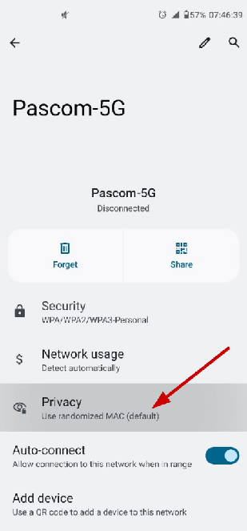</a>
<a href="images/configuracao-wifi-privacy-mac-device.png">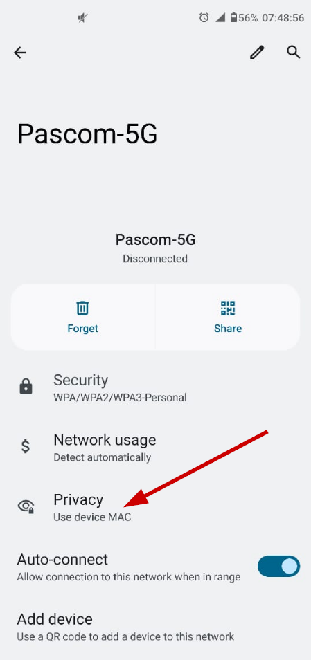</a>

Trocando ela para "Use device MAC", nós ficamos sempre com o mesmo ip no DroidCam. Isso funciona porque o roteador usa MAC para distribuir ip, e se celular manda um MAC diferente toda vez, o roteador não sabe que é o mesmo celular, daí ele distribui um ip diferente.

Essa é uma feature de segurança, para dificultar em redes públicas, alguém identificar seu celular e seguir por quais roteadores você usa. Mas como aqui é uma rede privada da igreja, não há problemas de segurança com relação a isso.

## Resolução de problemas

## Sem áudio na interface de som principal da igreja

1. Caso dispositivo principal `Mic/Aux` não esteja apresentando som, clique nos três pontinhos verticais do item `Mic/Aux` no painel `Mixer de Áudio` e vá em `Propriedades`:

   <a href="images/obs-menu-propriedades-mic-aux.png">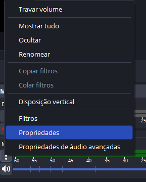</a>
2. Então, em `Dispositivo` selecione `Line 1/2 (4-M-AUDIO Fast Track Pro)`:

   <a href="images/obs-selecionar-dispositivo-m-audio.png">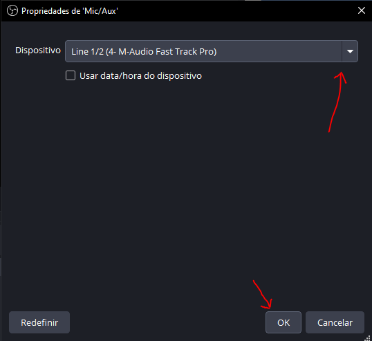</a>
3. E clique em OK.

## Verificar se dispositivos de som estão conectados corretamente

1. Clique com botão esquerdo no ícone de som na barra de tarefas e selecione a opção `Som`:

   <a href="images/windows-menu-som-barra-tarefas.png">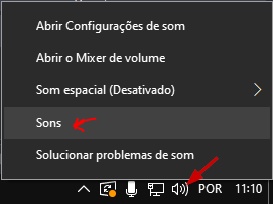</a>
2. Vá em `Gravação`, e verifique se `Line 1/2 (4-M-Audio Fast Track Pro)` está recebendo som:

   <a href="images/windows-gravacao-m-audio-recebendo-som.png">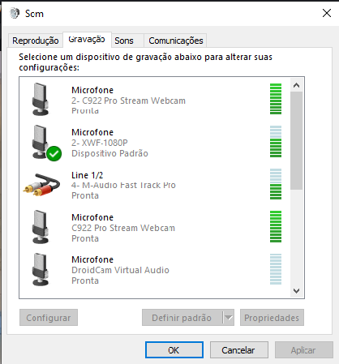</a>
   - Caso esteja com barrinhas verdes OK, o dispositivo de som da igreja está conectado corretamente.
   - Note que usualmente as barrinhas verdes de áudio podem não aparecer para dispositivo `Line 1/2`, porque por padrão seu volume fica selecionado mais baixo, nesse caso, é só ajustar o controle de volume (imagem abaixo, `4-M-Audio Fast Track Pro`) na mesa de som, girando um pouco para aumentar, que sons mais baixos irão fazer as barrinhas verdes aparecerem.

     <a href="images/m-audio-controle-volume.png">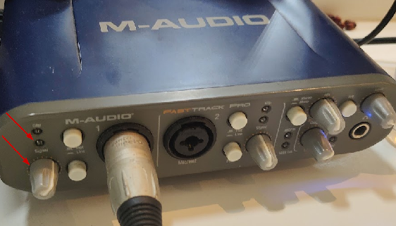</a>
   - Para saber se está chegando no dispositivo `4-M-Audio Fast Track Pro`, basta verificar se a luz `Signal` (imagem acima) está acendendo. Quanto mais baixo volume, mais fraco ela acende, quanto mais forte o volume, mais forte ela acende.
3. Nota, na mesa de transmissão, em cima do roteador, encontra-se o dispositivo `Line 1/2 (4-M-Audio Fast Track Pro)`, que está conectado por USB no computador. Ele puxa o áudio do sistema de som da igreja (`Yamaha Mixing Console MG32/14FX`) no cabo 6 da figura abaixo, e é a fonte `Mic/Aux` que utilizamos no OBS Studio.

   <a href="images/m-audio-conexao-mesa-som-yamaha.png">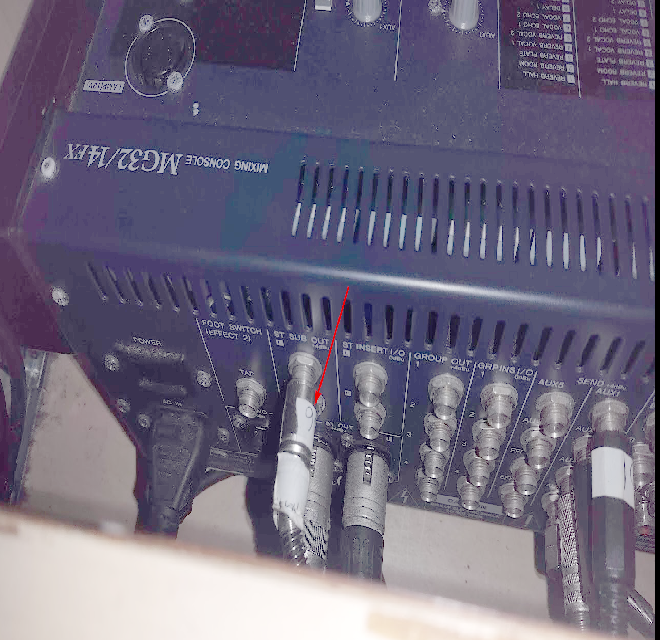</a>
4. Caso o som não esteja chegando no dispositivo 4-M-Áudio, a configuração da mesa de som `MG32/14FX`, precisa ser revista, para que ela encaminhe o áudio na porta do cabo 6, ou conectar esse cabo em outra porta que terá a saída do áudio.

## Ruídos nas transmissão

1. Tentei aumentar o volume da transmissão aumentando esse controle aqui, mas adicionou um chiado junto (menor que o de ontem, daí não percebi na hora). Só cuidar com esse botão para deixar ele mais baixo e se precisar mexer ali, escutar bem o áudio. Acho que para aumentar o áudio, precisa mesmo ver na mesa de som que manda o sinal para cá.

   <a href="images/m-audio-controle-volume-chiado.png">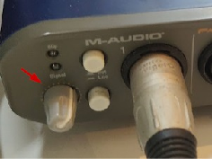</a>
2. A transmissão ficou com chiado hoje vindo da mesa de som. Verifiquei com Irene durante a missa e estavam ok os microfones. No final da missa verifiquei os cabos e resolvi ao recolocar esse cabo.

   <a href="images/cabo-mesa-som-resolver-chiado.png">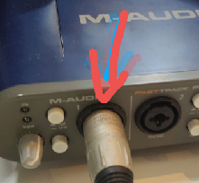</a>
3. ?

## Utilizar supressor de ruído

Quando fizemos os testes vimos que tinha um ruído saído da mesa de som. Daí adicionamos um supressor de ruído no OBS. Parecia bom, só que durante a missa terminou suprimindo os instrumentos e parte do canto da música. Mas os microfones do frei, preces e ambão ficaram ok. No final da missa removi o filtro de ruído, daí teve um chiado, mas a parte da música ficou normal. Quando testamos duas saídas da mesa de som, no dia do teste, a saída de gravação e a saída de fones de ouvido, ambas apresentavam chiado. Também tentamos interceptar a saída master para caixas de som, e não teve chiado, só que essa abordagem é meio invasiva, então como supressor de ruído parecia estar ok no dia, preferimos usar ele.

**Importante:** Sempre que fizer uma transmissão, escute o áudio pois mesmo tudo aparecendo certo no OBS, sem perda de frames, e qualidade Excelente no Youtube, não impede algum chiado estar aparecendo ou som saindo distorcido.

1. Clique nos três pontinhos para abrir menu da interface de áudio para ter ruído suprimido:

   <a href="images/obs-menu-audio-filtros.png">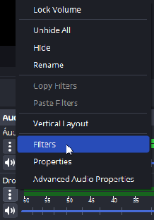</a>
2. Clique em adicionar:

   <a href="images/obs-adicionar-filtro-audio.png">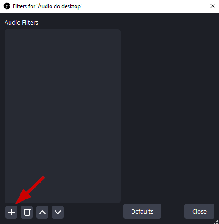</a>
3. Selecione `Noise Suppression`

   <a href="images/obs-selecionar-noise-suppression.png">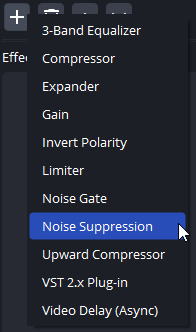</a>
4. Selecione o método de supressão:

   <a href="images/obs-metodo-supressao-ruido.png">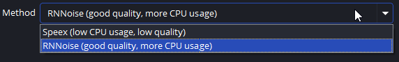</a>
5. Esses métodos de supressão são dinâmicos, ou seja, durante a transmissão ao vivo, ele podem ser adicionados, removidos ou configurados. Por isso, é importante sempre estar escutando áudio da missa para observar que efeitos eles estão tendo.
   1. Por exemplo, se o chiado está forte, o filtro de ruído pode ser adicionado em uma saída de áudio para ser usada durante as falas, mas removido em outra saída durante a música.
   2. Para isso, vá em Configurações de áudio, e configure duas saídas utilizando o mesmo dispositivo de áudio com o som da missa:

      <a href="images/obs-configurar-duas-saidas-audio.png">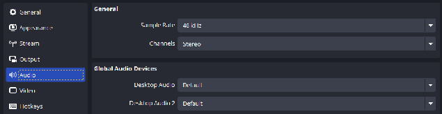</a>
   3. Depois, adicione o filtro em um dispositivo e remova do outro, assim, para alternar entre um e outro, mute um e desmute o outro, e vice-versa para destrocar, e alternar entre a saída com filtro e a sem.

      <a href="images/obs-alternar-audio-com-sem-filtro.png">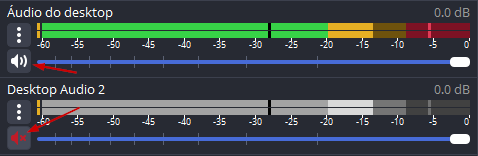</a>
6. ?

## Como ajustar volume da transmissão na mesa de som

Para mais detalhes da mesa de som, veja o documento: [Guia Rápido Mesa de Som - Tutorial](https://docs.google.com/document/d/1Loc9Vhdi47DgtfdWGkGnWSSYX-969GAH0OWDDuKh714/edit?tab=t.0)

De acordo com manual da mesa de som, [manual-mesa-de-som-mg32\_14fx.pdf](https://drive.google.com/file/d/1OGnDt-h1bqmv2ZekQLmICiYv1gARXX6E/view?usp=drive_link), nossa saída de áudio é a ST SUB OUT, localizada no seguinte controle:

<a href="images/yamaha-controle-st-sub-out.png">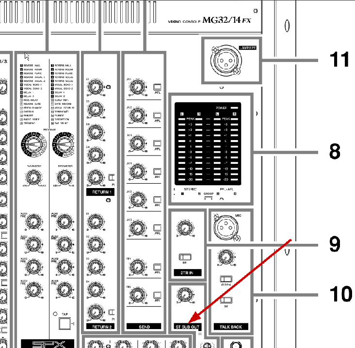</a>

Essa saída foi feita especialmente gravação do som, assim, ela é independente dos ajustes feitos nas saídas para caixas de som. No nosso caso ela é usada para transmissão.

Atrás da mesa de som, ST SUB OUT se encontra no item 8 da imagem a seguir, conforme manual da mesa de som:

<a href="images/yamaha-st-sub-out-traseira.png">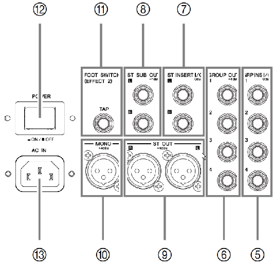</a>

## Como fazer

Para fazer a transmissão existem 2 cenários padrão configurados no OBS, `Youtube - Tripé 2 metros` e `Youtube - Tripé 4 metros`. Cada um possui diversas configurações de câmeras diferentes, mais a frente eles serão explicados. Ao montar o cenário, vá no menu `Coleção de cenas` e selecione o cenário que você irá fazer. Necessário usar a configuração de troca de cenários, porque os cenários de Tripé 2 e 4 metros são muito diferentes nas configurações e desmontar um para montar o outro sempre seria muito trabalhoso.

Caso queira criar uma variação do cenário Tripé 2 ou 4 metros, você pode ir no menu `Coleção de cenas` e selecionar `Duplicar`, a partir de um dos cenários que você queria adaptar. Nesse caso pode dar um nome como `Evandro - Tripé 4 metros`.

## Selecionar cenário correto (Tripé 2 metros ou Tripé 4 metros)

Antes de começar, faça a seleção do cenário correto para transmissão, indo no menu `Coleção de cenas` e selecionando as cenas do cenário `Tripé 2 metros` ou `Tripé 4 metros`. Necessário, pois ambos os cenários, possuem cenas muito diferentes e sempre recriar/configurar as cenas de um para outro, é relativamente trabalhoso.

<a href="images/obs-menu-colecao-cenas.png">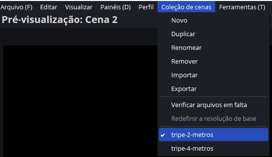</a>

## Como usar extensões USB

A especificação USB 2.0 limita o comprimento de um cabo entre dispositivos USB 2.0 (Full Speed ou Hi-Speed) a 5 metros, cabos USB 3.0 a 3 metros, e cabos USB-C a 0 metros (não aceitam extensões).

Pelos testes, o nosso cabo de 15 metros, funciona às vezes, e somente em algumas portas USBs específicas para somente algumas webcams. Temos 3 webcams, 2 logitech c920, uma webcam simples. A extensão de 15 metros, funciona somente para webcams logitech, a webcam simples não consegui ligar pelo cabo de 15 metros ativo (com repetidor), mas liga no cabo de 10 metros ativo. Todas as webcams funcionam com cabo de 10 metros ativo, sem erro e sempre de primeira. Os demais cabos que temos, de 2 e 5 metros, não conseguem ligar as webcams bem. O cabo de 2 e 3 metros (não ativo) funciona às vezes, igual ao cabo de 15 metros ativo. Já o de 5 metros (não ativo) não liga a câmera de jeito nenhum. Lembrando que a extensão de 15 metros é USB 3.0 ativa e a de 10 metros é USB 2.0 ativa.

Para compartilhar uma USB com longas distâncias, é necessário um adaptador USB para Ethernet. Só que ele precisa que nas duas pontas tenha uma alimentação de energia, assim, teria que levar dois cabos, 1 Ethernet, e 1 de alimentação. Outras soluções também envolvem levar o cabo USB junto com um outro cabo para prover alimentação na ponta oposta (um hub usb que fornece alimentação). Assim, o cabo USB leva os dados e o hub provê a energia (alimentação extra para ligar webcam).

1. Vamos agradecer que o cabo USB de 15 metros que temos funciona com um "jeitinho" para webcams mais caras/melhor construídas.
2. Cabo de 10 metros não funciona no notebook da mesa de som com a webcam simples (provavelmente pela má construção do cabo e menor potência da porta USB do notebook). Nesse caso, é necessário utilizar cabo simples de 3 metros.

## Como fazer flip da câmera (auto-foco, etc)

1. Basta acessar no navegador, o endereço: [http://192.168.0.3:4747/remote](http://192.168.0.3:4747/remote)
2. Clicar no ícone de câmera e selecionar sua câmera.

<a href="images/droidcam-controle-remoto-flip-camera.png">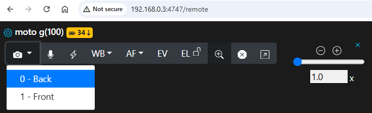</a>

## Como iniciar transmissão

Em um cenário com falta de tempo/imprevistos, uma vez configurado pelo menos uma das câmeras apontadas para o altar e/ou ambão, já podemos iniciar a transmissão pelo Youtube ou facebook:

1. No cenário `Tripé 2 metros` apontando a câmera do altar para `Ambão` manualmente, e depois rotacionando ela para produção de entrar e finalmente `Altar`.
2. No cenário `Tripé 4 metros` somente centralizando as cenas, somente uma câmera já consegue cobrir ambão, preces, slides e altar.
3. As demais câmeras, podemos configurar depois que a missa já iniciou, ou continuar somente com essa câmera até o final.
4. Caso você fique sem bateria para sua câmera principal, você pode fazer a troca com o celular da paróquia que fica cobrindo os músicos. Pois enquanto seu celular carrega, o celular a paróquia cobre o altar e vice-versa. Outra alternativa, é utilizar a webcam dedicada ao povo para cobrir o altar.
5. O importante é que a câmara não vai faltar, e assim, não tem motivo para não ter transmissão somente porque alguma coisa saiu errado com a montagem do cenário.

Antes de iniciar as transmissões, certifique-se que a cena principal é a de entrada, e os áudios dos microfones estão desativados:

<a href="images/obs-cena-entrada-audio-desativado.png">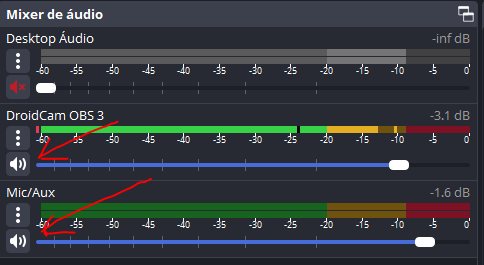</a>

- Depois, ao iniciar a missa, fique atento para ligar o áudio dos microfones.
- Não iniciar a transmissão da missa, muito tempos antes da missa começar, pois quem está acompanhando pela internet, pode ser alguém de mais idade que vai ficar sem entender porque nada aparece. Assim, eventualmente, vamos adicionar um cronômetro que informa horário da missa e quanto tempo falta para iniciar.

## Depois de iniciar a transmissão verificar perda de frames

Uma vez que a transmissão já iniciou, conforme as seções a seguir, é necessário observar no OBS se está acontecendo perda de frames:

<a href="images/obs-verificar-perda-frames.png">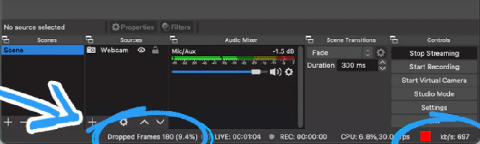</a>

Caso, esteja acontecendo logo no início, e seja uma perda constante, é necessário parar a transmissão e reduzir a resolução e a taxa de bitrate utilizado. Por padrão, é utilizado 5000 Kbps de bitrate e 1080p como resolução de saída. O que controla a largura de banda utilizada (internet) é a taxa de bitrate.

1. Transmitir com uma resolução de 720p, com um bitrate de 5000Kbps, vai ter uma qualidade muito boa, mas uma bitrate de 2500 Kbps, já é suficiente para uma transmissão em 720p.
2. Transmitir com um bitrate de 2500 Kbps com uma resolução de 1080p, não será dados suficientes e a transmissão ficará sendo com a resolução de 720p, pois 2500 Kbps não tem informações suficientes para resolução de 1080p. Assim, é necessário ajudar a taxa de bitrate de acordo com a resolução utilizada.
3. Também cuidar com qual chave de API do youtube ou outro sistema de stream utilizado, pois por padrão youtube esperar um bitrate variável, mas chaves específicas para um bitrate fixo pode ser criado.

   <a href="images/obs-configuracao-bitrate-parte1.png">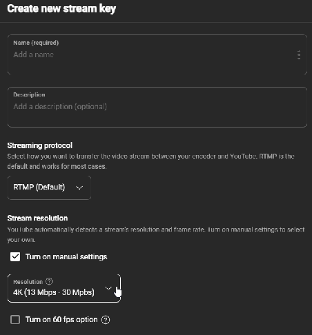</a>

   <a href="images/obs-configuracao-bitrate-parte2.png">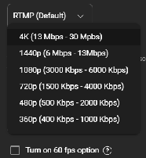</a>
4. ?

## Também acessar a plataforma de transmissão

1. E observar nas estatísticas dela se ela reporta alguma perda de frame ou qualidade baixa para transmissão:

   <a href="images/youtube-estatisticas-transmissao.png">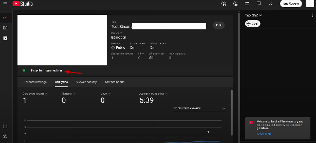</a>
2. Também monitorar durante a transmissão a seção de live-chat para ver se alguém reportou algum problema com a transmissão que não foi detectado por nós.
3. Nela, se configurável, preferir latências mais altas, por exemplo, no youtube é permitido configurar Normal, Low-Latency e Ultra low-latency. Sempre preferir a opção `Normal`, pois os que assistem a missa pela internet não vão se importar de esperar um pouco entre o que acontece na missa, e o que chega na transmissão em tempo real. Mas vão se incomodar se por uma instabilidade da internet da igreja, cortar um pedaço da missa, que ficará gravada, faltando partes.

   <a href="images/youtube-configuracao-latencia.png">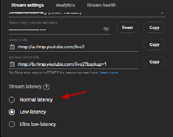</a>

   **Descrição:** A latência de transmissão é o atraso entre o que sua câmera captura e o momento em que é exibido aos espectadores. A opção Normal oferece maior qualidade de vídeo e é ideal se você não quiser interagir com o público; a opção Baixa, se quiser interagir quase em tempo real; e a opção Ultra Baixa, se quiser alta interação e engajamento.
   1. Com um nível normal, demora mais para uma cena parecer na transmissão, pois o YouTube espera mais tempo antes de mostrar a cena, para garantir que ele recebeu todos os dados. Isso é essencial para conexões que podem ser instáveis, assim, caso a internet engasgue por alguns segundos, isso não é perceptível na transmissão, pois ela consegue recuperar os dados.
   2. Com nível Ultra low-latency, caso haja alguma instabilidade na conexão, irá imediatamente travar a transmissão e irá se perder parte da cena.

### Youtube

Esse é nosso método principal de transmissão. A missa, precisa no mínimo ser transmitida pelo Youtube.

1. Acesse a página principal do youtube [https://www.youtube.com/](https://www.youtube.com/), e clique em `Criar`.
2. Depois selecione `Transmitir ao vivo`.
3. Caso seja perguntado, clique em `Agora mesmo`, `Iniciar` e em `Software Streaming`.
4. Clique em `Editar`, e coloque o título da missa de acordo com o livrinho das missas para o dia de hoje, e edite a descrição do vídeo com a data da missa. Depois clique em `Copiar` para copiar o token de transmissão do youtube.

   <a href="images/youtube-editar-transmissao-copiar-token.png">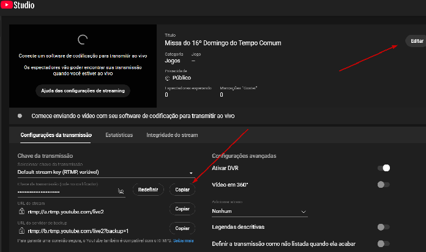</a>
5. Agora, volte o OBS e clique em `Configurações` no painel `Controles`:

   <a href="images/obs-painel-controles-configuracoes.png">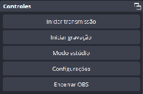</a>
6. Vá em `Transmissão -> Usar chave de transmissão (avançado)`.

   <a href="images/obs-transmissao-chave-avancado.png">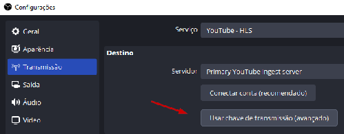</a>
7. Então adicione a chave de transmissão e clique OK.

   <a href="images/obs-adicionar-chave-transmissao.png">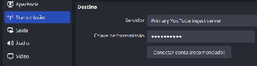</a>
8. Depois, vá novamente no painel `Controles` e clique em `Iniciar transmissão`:
9. Por fim, volte na página do Youtube, e verifique se a transmissão iniciou corretamente.
10. Espere até a missa iniciar e faça a transição para `Ambão` ou mesa de `Preces` e reative o áudio dos microfones.
11. De vez em quando, monitore a página do Youtube para ver se tem alguma reclamação em relação a transmissão, como falta de áudio, etc.
12. Por fim, ao final da missa, coloque a cena `Final`, enquanto espera a música saida da missa acabar, e desative o áudio da transmissão.
13. Clique em `Encerrar transmissão` no painel `Controles` do OBS e também vá ao Youtube e clique em `Encerrar transmissão` para finalizar, caso contrário, youtube irá ficar esperando o fim da transmissão eternamente.

### Facebook

Este é o nosso método secundário de transmissão. Caso tenha algum problema, já é suficiente que a missa esteja sendo transmitida pelo Youtube.

1. Depois de configurar a transmissão pelo youtube, acesse a página principal do facebook [https://www.facebook.com/](https://www.facebook.com/) e clique em `Video ao vivo`.
2. Clique em `Fazer live`.
3. Em `Adicionar detalhes do post`, copie o título da missa e a descrição dela do Youtube

   <a href="images/facebook-adicionar-detalhes-post.png">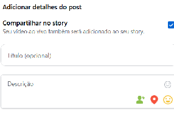</a>
4. Em `Selecionar a origem do vídeo` clique em `Software de streaming` e copie a `Chave de stream`.

   <a href="images/facebook-copiar-chave-stream.png">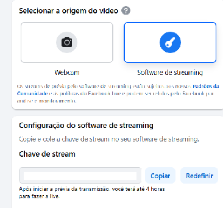</a>
5. Agora no OBS, vá no painel `Múltiplas saídas -> Facebook`, e clique em `Alterar`.

   <a href="images/obs-multiplas-saidas-facebook-alterar.png">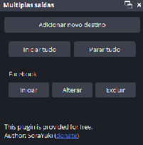</a>
6. Então insira a chave de transmissão copiada no campo `Chave de transmissão` e clique em OK.

   <a href="images/obs-facebook-inserir-chave-transmissao.png">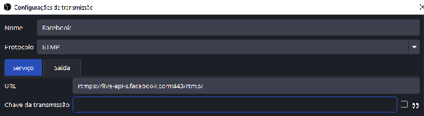</a>
7. Agora no painel `Múltiplas saídas` clique em `Iniciar`.
8. Volte no facebook e clique em `Transmitir ao vivo` para iniciar a transmissão para valer.

   <a href="images/facebook-transmitir-ao-vivo.png">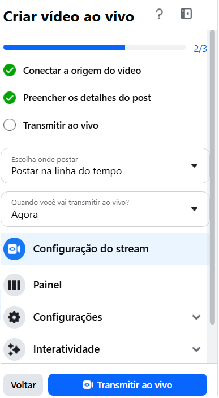</a>
   1. Diferente do youtube, onde a transmissão inicia ao clicar que iniciar transmissão o OBS, para facebook, é necessário além de clicar em `Iniciar` no OBS, é necessário também fazer o mesmo na página do facebook.
9. Transmissão feita com sucesso, agora do mesmo modo que com youtube, também monitore ocasionalmente a página do facebook para:
   1. Ver se alguém reclama de algum problema na transmissão como áudio mudo.
   2. Se alguém faz spam de propagandas no chat (e precisa ser apagada).
10. Diferente do youtube, ao clicar em `Finalizar transmissão` no OBS, a transmissão no facebook é encerrada automáticamente, sem a necessidade de clicar em algum botão de finalização.

## Ativando som pelo celular

Somente usar essa opção em um momento de pane onde não é conseguido obter o áudio pelo sistema de som `4-M-Audio Fast Track Pro`.

1. Caso áudio principal Mic/Aux abaixo não esteja recebendo som:

   <a href="images/obs-audio-mic-aux-sem-som.png">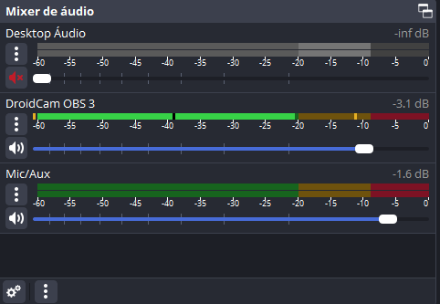</a>
2. Ative o áudio pela câmera do seu celular, indo das propriedades do dispositivo `DroidCam OBS 3`, e marque a opção, `Desativar`, depois clique em `Habilitar áudio`, então clique em `Ativar` e então OK para salvar:

   <a href="images/obs-droidcam-habilitar-audio.png">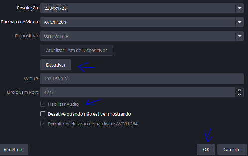</a>
3. Por fim, habilite o áudio da câmera OBS no `Mixer de áudio`. Isso deve ser suficiente para ter algum áudio disponível na missa:

   <a href="images/obs-mixer-audio-habilitar-droidcam.png">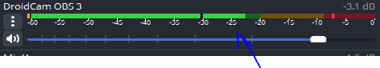</a>
4. Infelizmente, nesse modo, é necessário manter a câmera principal sempre ativa, caso contrário o dispositivo de som é desativado.
   - No cenário Tripé 4 metros é possível cobrir todo altar somente com a câmera principal, incluindo comunhão de costas frente ao altar. Assim, não é muito problema usar somente a câmera principal.

## Adicionando áudio por uma das Webcams

Somente usar essa opção em um momento de pane onde não é conseguido obter o áudio pelo sistema de som `4-M-Audio Fast Track Pro`.

1. Para novas opções de áudio aparecerem no painel, `Mixer de Áudio` é necessário habilitar elas pelo menu `Arquivo -> Configurações -> Áudio`.
2. Então selecione um dispositivo e mude de `Desativado` para no nome da interface de áudio que você quer capturar (webcam).

   <a href="images/obs-configuracoes-audio-adicionar-interface.png">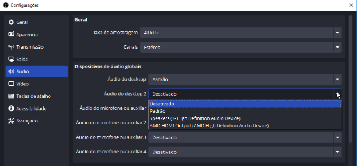</a>
3. Então, clique em OK e essa nova interface irá aparecer no painel `Mixer de Áudio`.

## Como configurar uma webcam no OBS

Note que já existem fontes configuradas no OBS, assim, não é necessário re-adicionar o celular principal, celular da mesa de canto, nem as webcams. Basta clicar em editar uma fonte já existente e fazer ajustes como trocar ip (droidcam) ou reduzir brilho (webcam).

1. Vá no panel `Fontes`
2. Clique em adicionar

   <a href="images/obs-fontes-adicionar.png">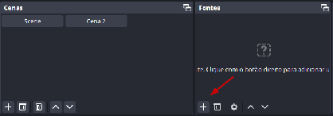</a>
3. Selecione `Dispositivos de captura de vídeo`

   <a href="images/obs-adicionar-dispositivo-captura-video.png">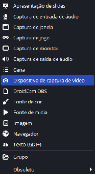</a>
4. Escolha `Criar nova` ou `Reutilizar existente`

   <a href="images/obs-criar-nova-ou-reutilizar-fonte.png">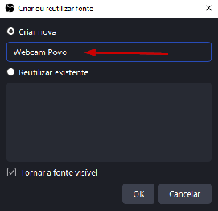</a>
   1. Criar nova, vai criar uma nova fonte independente que pode ser configurada isolada.
   2. Reutilizar existente, vai usar uma fonte já existente, e caso ela seja modificada, como resolução e brilho, todas as cenas que utilizam essa fonte vão ser afetadas. Bom para configurar somente uma vez e ter a mesma configuração propaganda para todos os cenários.
5. Ao criar o dispositivo, selecione a webcam na lista, e clique em `Ativar` para começar a mostrar a imagem dela:

   <a href="images/obs-configurar-webcam.png">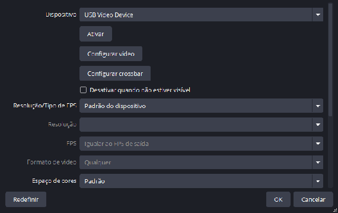</a>
   1. As webcams que conectam no cabo de 15 metros, podem não ser reconhecidas de primeira. Para reconhecer ela, é preciso paciência e não esperar por ela para iniciar a transmissão da missa. Assim, para evitar problemas, usar o cabo de 15 metros somente ao montar cenário com `Tripé 4 metros`, pois com ele, o uso da webcam com cabo de 15 metros fica opcional, pois a vista do ambão já é coberta pela câmera principal. E a visão povo, pode ser coberta pela webcam que conecta diretamente no computador.
   2. Para tentar fazer a webcam com cabo de 15 metros, conectar, podemos tentar ir no campo `Resolução/Tipo de FPS` e Selecionar `Personalizada` e depois voltar ao `Padrão do dispositivo`. Tentar clicar e `Ativar` e `Desativar` o dispositivo. Tentar desconectar e reconectar o cabo em outra USB.
   3. Caso ela não ligue, continue a somente com a missa com a câmera principal. Para mostrar o ambão, você pode usar o celular que fica com câmera do canto virada para o ambão com zoom. Ou também, como é um celular, se ele tiver bateria, você pode levar ele com tripé e colocar no lugar do câmera do ambão.
6. Clique `OK` para adicionar.

## Como configurar uma câmera DroidCam diretamente no OBS

Note que já existem fontes configuradas no OBS, assim, não é necessário re-adicionar o celular principal, celular da mesa de canto, nem as webcams. Basta clicar em editar uma fonte já existente e fazer ajustes como trocar ip (droidcam) ou reduzir brilho (webcam).

1. Vá no panel `Fontes`
2. Clique em adicionar

   <a href="images/obs-fontes-adicionar.png"></a>
3. Selecione `DroidCam OBS`

   <a href="images/obs-adicionar-droidcam-obs.png">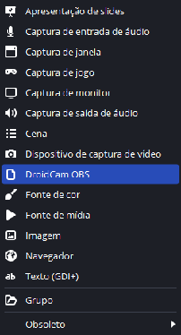</a>
4. Escolha `Criar nova` ou `Reutilizar existente`

   <a href="images/obs-droidcam-criar-nova-ou-reutilizar.png">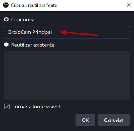</a>
   1. Criar nova, vai criar uma nova fonte independente que pode ser configurada isolada.
   2. Reutilizar existente, vai usar uma fonte já existente, e caso ela seja modificada, como resolução e brilho, todas as cenas que utilizam essa fonte vão ser afetadas. Bom para configurar somente uma vez e ter a mesma configuração propaganda para todos os cenários.
5. Ao criar o dispositivo, preencha com ip do seu celular, que é mostrado ao abrir aplicativo `DroidCam Webcam & OBS Camera`, e clique em `Ativar` para começar a mostrar a imagem dela:

   <a href="images/obs-droidcam-configurar-ip.png">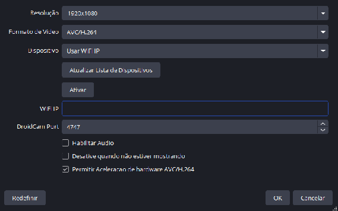</a>
   1. Caso a imagem fique preta ao ativar a câmera, verifique se a tela do seu celular está ligada e o aplicativo DroidCam está aberto. Caso a tela tenha desligado antes do OBS conectar com seu celular, ele não vai conseguir conectar até você religar a tela do seu celular.
   2. Outro motivo para a tela ficar preta, é a resolução configurada no OBS, não ser suportada pelo seu celular. Nesse caso, irá ter um erro aparecendo no canto inferior da tela do seu celular dizendo que a resolução não é suportada. Nesse caso, troque para outra resolução. Você pode usar o aplicativo `Camera2 API Probe` para ver quais resoluções são suportadas pela sua câmera, e digitar a resolução correta no campo `Resolução`.
   3. Desmarque a opção `Habilitar Áudio`, pois isso irá gerar um processamento extra e gastar mais bateria do seu celular. A não ser que você vá usar o áudio do celular, para incluir na transmissão as respostas eucarísticas do povo.
6. Clique `OK` para adicionar.

## Ajustes

### Distribuição das câmeras com tripé 4 metros

<a href="images/distribuicao-cameras-tripe-4-metros.png">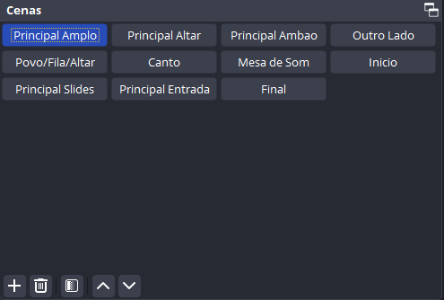</a>

Cenário de configuração mais complexa, pois envolve mais cuidados com câmera principal que precisa estar muito bem posicionada, em um ângulo de inclinação e altura exata do tripé. Mas com a configuração correta, podemos:

- Ter uma visão completa de todos os cenários da igreja, que não poderiam ser cobertos tão facilmente.
  - Devido maior ângulo de visão \[e zooms feitos\], para manter a qualidade da imagem, a transmissão a partir do celular precisa ser feita em 4K em vez de 1080P ou 1080p com alta qualidade.
- Com esse ângulo maior, não é necessário mais se deslocar durante a missa para fazer ajustes na câmera, pois ela abrange todos os pontos necessários do altar, comunhão, incluindo procissão de entrada e saída.

Cenário completo: câmeras marcas com **\***

```text
┌---------------------15 metros ----------------------------┑
         cruz são damião                    nossa senhora
_______________ambão____________altar___________________________________
*  preces    ___________________      ________________       *mesa de transmissão
            |___________________|    |________________|      |*         |
           |____________________|    |_________________|     | músicos  | 10 metros
          |_____________________|⁎   |__________________|    |          |
          ----------------------      -------------------    | mesa de som
saída    |______________________|    |___________________| *|caixa de som
lateral |_______________________|    |____________________|  |
       |________________________|    |_____________________|  |
      |_________________________|    |______________________|  |
      --------------------------      -----------------------   |
    |___________________________|    |________________________|  |
   |____________________________|    |_________________________|  |
  |_____________________________|    |__________________________|  |
 |______________________________|    |___________________________|  |
                               entrada
```

- Nas preces fica uma webcam logitech para o povo do outro lado.
- Na mesa de transmissão fica webcam logitech para o povo desse lado.
- Na caixa de som fica webcam simples apontada para os dois lados, pegando o povo dos dois lados de costas, mas também mostrando altar também (essa câmera não pode ser usada sem zoom adequado durante a comunhão, pois mostra o povo de costas fazendo a comunhão, mas quando eles são a volta para sentar no banco, é possível ver o rosto, assim, é necessário fazer zoom para que não mostre a pessoa de frente quando ela faz a volta).
  - A câmera da caixa de som é opcional, e pode ser usada também em um tripé de 2 metros ao lado da placa de banheiro fechado (em baixo da TV de slides).
- Nos músicos, fica o celular da paróquia, conectado no carregador dele, com flip da câmara, ele é capaz de pegar o altar e os músicos, e durante a comunhão, de pegar o povo de costas. Para essa câmera, é melhor colocar o tripé de celular de modo que ela consiga pegar os músicos e as pessoas de costas na comunhão (avisar ministros para não ficarem do lado da câmera) Caso haja muitos músicos (coral), não usar tripé e deixar a câmera em cima da mesa de transmissão, com tripé pequeno de mesa que ela tem. Já é capaz de pegar pode de "costas" (pouco de lado).
- No centro, fica o celular principal, com tripé de 4 metros de altura, para pegar, ambão, altar, os slides pelo projetor, nossa senhora, comunhão de costas, e a procissão de entrada e saída da missa (com flip da câmera frontal).

Para conectar webcam simples da caixa de som, precisamos usar computador da mesa de som como um intermediário, pois não temos cabo que alcance os 15 metros necessários. O cabo que temos de 15 metros não funciona com webcam simples, e precisamos dele para colocar a webcam logitech no ambão ou atrás das preces para ter visão do povo pelo outro lado. Usando o software [https://www.virtualhere.com/windows\_server\_software](https://www.virtualhere.com/windows_server_software) e [https://www.virtualhere.com/usb\_client\_software](https://www.virtualhere.com/usb_client_software), conseguimos gratuitamente, compartilhar um dispositivo USB pela rede local (sem precisar comprar a licença do software). Assim, podemos conectar uma webcam no notebook da mesa de som, e usar essa webcam diretamente no OBS do computador da mesa de transmissão. Esse cenário funciona usando o cabo de 10 metros, para colocar uma webcam na caixa de som que fica no corredor, antes da mesa de som entrando na igreja.

### Distribuição das câmeras com tripé 2 metros

Cenário igual ao do `Tripé 4 metros` com algumas variações. Cenário mais simples de configurar e controlar, e pode ser usado sem precisar comprar licença do OBS para poder fazer flip da câmera frontal e traseira para pegar a entrada/saída (e utilizar full hd/4K). Nesse caso, é necessário manualmente girar a câmera na procissão de entrada e saída.

Cenário completo: câmeras marcas com **\***

```text
┌---------------------15 metros ----------------------------┑
         cruz são damião                    nossa senhora
_______________ambão____________altar___________________________________
   preces    ____*______________     ⁎________________       *mesa de transmissão
            |___________________|    |________________|      |*         |
           |____________________|    |_________________|     | músicos  | 10 metros
          |_____________________|    |__________________|    |          |
          ----------------------      -------------------    | mesa de som
saída    |______________________|    |___________________| *|caixa de som
lateral |_______________________|    |____________________|  |
       |________________________|    |_____________________|  |
      |_________________________|    |______________________|  |
      --------------------------      -----------------------   |
    |___________________________|    |________________________|  |
   |____________________________|    |_________________________|  |
  |_____________________________|    |__________________________|  |
 |______________________________|    |___________________________|  |
                               entrada
```

- Nas preces fica sem uma webcam logitech, que vai para frente do ambão.
- Na mesa de transmissão fica webcam logitech para o povo desse lado.
- Na caixa de som fica igual ao outro cenário `tripé 4 metros`.
- Nos músicos, fica o celular da paróquia, igual ao cenário `tripé 4 metros`.
- No centro, fica o celular principal, com `Tripé 2 metros` de altura, para pegar, altar, comunhão de costas, e a procissão de entrada e saída da missa (com flip da câmera frontal).

## Como corrigir brilho da webcam

Em dias de sol, se a webcam conseguir enxergar a janela, a imagem ficará com muita saturação e brilho. Isso porque a câmera tenta fazer controle de brilho automático. Para resolver, basta desativar controle de brilho automático, editando as configurações da webcam em `Propriedades -\> Configurar Vídeo`:

<a href="images/obs-configurar-brilho-webcam.png">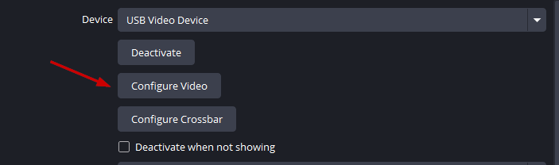</a>

Depois, desativar o `Exposure`:

<a href="images/obs-desativar-exposure-webcam.png">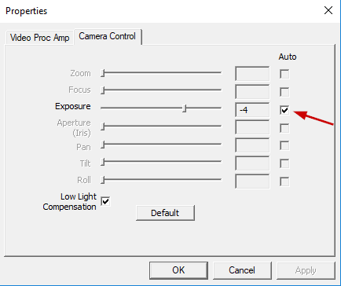</a>

Ou ajustar o brilho e saturação:

<a href="images/obs-ajustar-brilho-saturacao-webcam.png">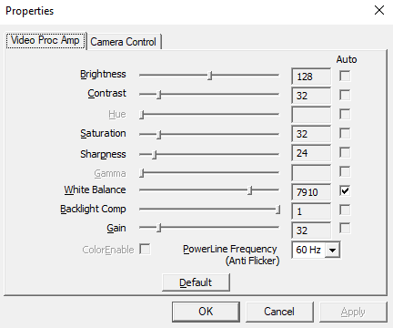</a>

## Como corrigir brilho do celular

Caso o celular esteja vendo a janela em um dia de sol, a imagem de dentro da igreja irá ficar escura. Para o celular principal, ver a procissão de entrada (cenário `Tripé 4 metros`), não é possível inclinar ele para baixo, pois ele deixaria de pegar o altar.

1. Então, usando os mesmos controles remotos para fazer o flip do celular, podemos forçar um determinado nível de brilho.
2. Basta acessar endereço [`http://ip.seu.celular:4747/remote`](http://ip.seu.celular:4747/remote), então clicar em EV (Exposure) e ajustar o valor até ficar iluminação adequada

   <a href="images/droidcam-ajustar-exposure-ev.png"></a>
3. Também clique na opção `EL` (Auto Exposure Lock) para que o celular não desfaça a configuração que acabamos de forçar.

   <a href="images/droidcam-auto-exposure-lock.png"></a>
4. A opção `EL`, deve estar com cadeado fechado como acima.
5. A opção `WB` (White Balance) também pode ser necessária ajuste. Primeiro é necessário clicar na opção `🔒`, antes de selecionar `Manual` e poder alterar o valor.

   <a href="images/droidcam-white-balance-manual.png"></a>
6. Para reverter ao normal, basta clicar em `Auto` no início e a câmera irá se auto configurar novamente.

## Transmissão em 4K

- **Cuidado:** com bateria ao transmitir em 4K, pois certamente irá usar mais bateria ou causar lentidão ao transmitir por usar muitos dados se usar qualidade máxima em vez de normal. Caso esteja com pouca bateria, use 720p e desligue a transmissão de áudio.
- **IMPORTANTE:** Quando é feito o flip entre a câmeras frontal e traseira, e a frontal não suporta 4K, a imagem/tela fica preta até a resolução da câmera ser trocada para 1080p (suportada pela câmera frontal).
- **IMPORTANTE:** Quando utilizar 4k, configurar `DroidCam` com qualidade manual, com 1 segundos de `keyframe` (para quando travar, voltar mais rápido, caso seja um valor alto, como 10 segundos, a imagem quando travar vai travar por 10 segundos). Usando `16` `Mbps` como `Target` `Bitrate`, pois por algum bug no Droidcam, ele trava a imagem a cada x segundos. Talvez em Iphone não tenha esse problema. `Target quality` pode ser `90%`.

### Ativar alta qualidade DroidCam no Android

Para ativar alta resolução com alta qualidade, basta acessar as configurações do DroidCam no Android ou no iPhone:

1. Três pontinho no canto esquerdo superior: ... -\> Settings

   <a href="images/droidcam-android-settings-menu.png"></a>
2. Opção: Video

   <a href="images/droidcam-android-video-settings.png"></a>
3. Selecionar: Very high em Target Quality

   <a href="images/droidcam-android-target-quality-very-high.png"></a>

### Congelamentos com DroidCam em 4K ou 720p

Caso transmissão em 4k, congele por alguns segundos, periodicamente, altere a configuração de automática (low, normal, high, very high), e utilize a opção `Manual (Advanced Options)`. E configure para usar 1 segundo de Key Frame Interval, JPG Quality 90%, e 16Mbps de Target Bitrate, para 4k. Para transmissão de 720, utilize 4Mbps em vez de 16Mbps.

## Usar resoluções ocultas (intermediárias entre 1080p e 4K)

Para simplificar a troca entre as câmeras frontais traseiras, quando ambas não suportam 4K, podemos verificar se sua câmera frontal possui uma resolução intermediária ao 4K. Assim, é necessário trocar a resolução da transmissão durante o flip de câmeras.

Por padrão, o plugin OBS para droidcam ([https://github.com/dev47apps/droidcam-obs-plugin/releases](https://github.com/dev47apps/droidcam-obs-plugin/releases)) somente mostra algumas resoluções padrão para sua câmera. Mas ela provavelmente suporta mais resoluções além do que 1080p e 4K. Para ver essas resoluções adicionais, utilize o aplicativo [https://play.google.com/store/apps/details?id=com.airbeat.device.inspector](https://play.google.com/store/apps/details?id=com.airbeat.device.inspector&hl=en) (Camera2 API Probe).

1. Ao abrir ele, procure sua câmera frontal e veja qual tem maior resolução suportada. Nesse caso, é 2304x1728 (superior à Full HD 1080 x 1920). Na lista terá todas as suas câmeras suportadas, navegue por ela até encontrar as duas duas câmeras e encontre a maior resolução em comum entre elas.

   <a href="images/camera2-api-probe-resolucoes-suportadas.png"></a>
2. Apesar de ter aspecto 4:3, capta a mesma área de visão que em 1080p, com a diferença que agora temos muito mais visão na vertical (para cima e para baixo). Isso acontece aqui, porque essa câmara foi construída no formato 4:3, e para transformar isso em 16:9, as bordas superiores e inferiores são cortadas, dando criando a imagem 16:9 em 1080p.
3. Agora no OBS Studio, digite a maior resolução da sua câmera frontal, e salve as modificações.

   <a href="images/obs-droidcam-resolucao-customizada.png"></a>
4. Somente lembrar de verificar que essa maior resolução também é suportada por sua câmera traseira, caso contrário ao fazer flip das câmeras, a tela irá ficar preta até você ajustar para uma resolução suportada pela outra câmera.

### Como ativar 4K no DroidCam OBS Studio

[https://droidcam.app/obs/4k.html](https://droidcam.app/obs/4k.html)

1\. Check the minimum requirements for 4K support:
Version 29.1+ of [OBS Studio](https://obsproject.com/)
Latest (v2.2+) of [DroidCam OBS plugin](https://droidcam.app/obs/#plugin)
Latest (v4.0+) of [DroidCam apps](https://droidcam.app/obs/#apps).

2\. In OBS Studio, add a new DroidCam source or open the Properties of an existing source and Deactivate it if necessary.

3\. Select 'Use WIFI IP' in the Device drop-down, enter 4k in the WiFi IP field, and click \[Activate\].
You should see a confirmation message. Dismiss the message and click "OK" to save the changes.

<a href="images/droidcam-obs-ativar-4k-confirmacao.png"></a>

Re-open the Properties of this source, and check the Resolution drop-down for new options.
Be sure 'Allow hardware acceleration' is ticked, and give it a go by [connecting to your phone](https://droidcam.app/obs/usage/).

640x480 - 4:3
1024x768 - 4:3
1280x720 - 16:9 HD
1920x1080 - 16:9 FHD
1920x1440 - 4:3 QHD
2560x1440 - 16:9 QHD
3840x2160 - 16:9 UHD

<a href="images/droidcam-obs-resolucoes-4k-disponiveis.png"></a>

If your phone does not support the exact built-in resolutions listed above, you can input custom values into the 'Resolution' field of your DroidCam OBS source. This is available as of [version 2.4.0](https://github.com/dev47apps/droidcam-obs-plugin/releases) of the DroidCam plugin. Use the 'Camera Information' option in the DroidCam app settings to get a list of supported capture resolutions on you particular device.
