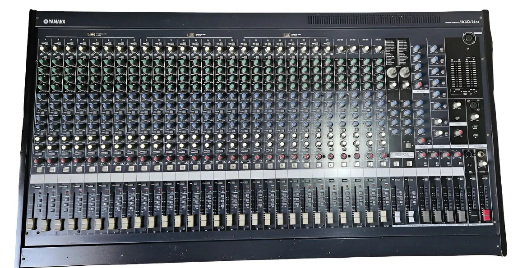
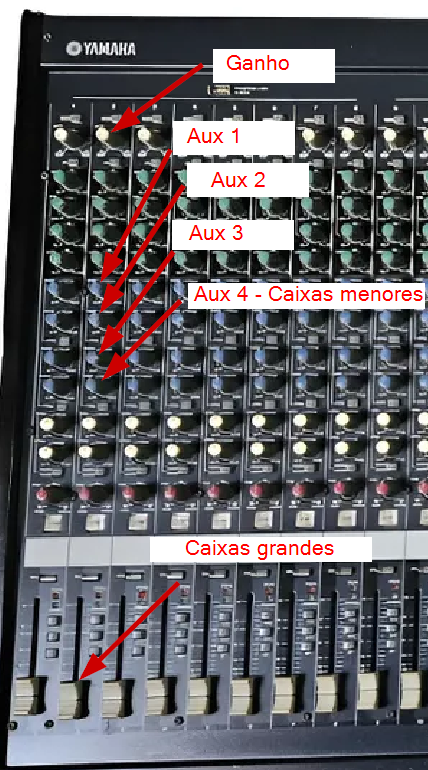
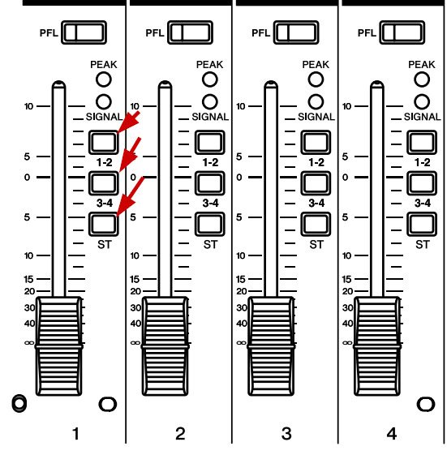
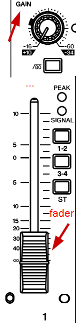
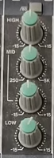
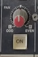
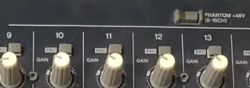
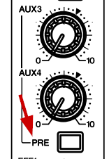
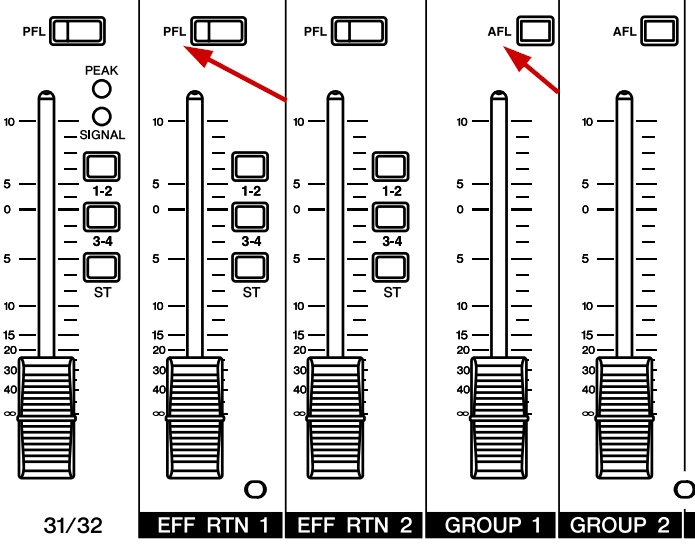
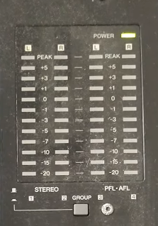

# Guia Mesa de Som



Manual oficial do mesa: <https://usa.yamaha.com/files/download/other_assets/9/333859/mg32_14fx_pt.pdf>

## Índice

- [1. Introdução](#1-introdução)
  - [Nosso objetivo](#nosso-objetivo)
  - [Princípio orientador](#princípio-orientador)
  - [Antes de começar (checklist de segurança)](#antes-de-começar-checklist-de-segurança)
- [2. Operação básica de um canal](#2-operação-básica-de-um-canal)
  - [O caminho do som (visão geral)](#o-caminho-do-som-visão-geral)
  - [A. O som principal (as 4 grandes caixas dos cantos)](#a-o-som-principal-as-4-grandes-caixas-dos-cantos)
  - [A regra dos 3 botões (onde o som morre)](#a-regra-dos-3-botões-onde-o-som-morre)
    - [O que acontece se nenhum estiver apertado?](#o-que-acontece-se-nenhum-estiver-apertado)
    - [A solução padrão (o "ST")](#a-solução-padrão-o-st)
  - [O segredo do som limpo: ganho vs. volume](#o-segredo-do-som-limpo-ganho-vs-volume)
  - [Como regular um canal do zero (passo a passo)](#como-regular-um-canal-do-zero-passo-a-passo)
  - [O problema da dinâmica de voz (e por que o GAIN sozinho não resolve)](#o-problema-da-dinâmica-de-voz-e-por-que-o-gain-sozinho-não-resolve)
  - [Entendendo as luzes (o semáforo do som)](#entendendo-as-luzes-o-semáforo-do-som)
- [3. Controles adicionais do canal](#3-controles-adicionais-do-canal)
  - [Equalização básica (EQ) - deixando o som claro](#equalização-básica-eq---deixando-o-som-claro)
  - [O botão PAN (balanço) - não mexa sem necessidade](#o-botão-pan-balanço---não-mexa-sem-necessidade)
  - [Phantom Power (+48V) - para microfones especiais](#phantom-power-48v---para-microfones-especiais)
  - [Os botões giratórios AUX (visão geral)](#os-botões-giratórios-aux-visão-geral)
- [4. Controlando os retornos (o que os músicos ouvem)](#4-controlando-os-retornos-o-que-os-músicos-ouvem)
  - [AUX 1 e 2 - retornos dos músicos](#aux-1-e-2---retornos-dos-músicos)
  - [A regra de ouro (botão PRE)](#a-regra-de-ouro-botão-pre)
  - [O cenário do caos (o que acontece se o PRE estiver solto)](#o-cenário-do-caos-o-que-acontece-se-o-pre-estiver-solto)
  - [AUX 3 e 4 - configurando como auxiliares POST](#aux-3-e-4---configurando-como-auxiliares-post)
- [5. Entendendo as saídas: onde ligar a gravação?](#5-entendendo-as-saídas-onde-ligar-a-gravação)
  - [A vencedora: ST SUB OUT (a profissional)](#a-vencedora-st-sub-out-a-profissional)
  - [AUX 3 OUT - mixagem personalizada (avançado)](#aux-3-out---mixagem-personalizada-avançado)
  - [As perigosas](#as-perigosas)
    - [MONO OUT - o som fica "abafado"](#mono-out---o-som-fica-abafado)
    - [REC OUT (RCA) - sem controle de volume](#rec-out-rca---sem-controle-de-volume)
  - [Veredito final](#veredito-final)
- [6. Como usar AFL e PFL (os botões de escuta solo)](#6-como-usar-afl-e-pfl-os-botões-de-escuta-solo)
  - [O que significam as siglas?](#o-que-significam-as-siglas)
  - [Como usar na prática](#como-usar-na-prática)
  - [Quando usar (casos práticos)](#quando-usar-casos-práticos)
  - [Importante: não afeta o som da igreja](#importante-não-afeta-o-som-da-igreja)
  - [AFL nos grupos (1-2, 3-4) e Master (ST/MONO)](#afl-nos-grupos-1-2-3-4-e-master-stmono)
    - [O que muda?](#o-que-muda)
    - [Exemplo prático: monitorar a bateria agrupada](#exemplo-prático-monitorar-a-bateria-agrupada)
    - [Apertar AFL de dois grupos ao mesmo tempo](#apertar-afl-de-dois-grupos-ao-mesmo-tempo)
- [7. Entendendo os medidores (as 4 fileiras de luzes)](#7-entendendo-os-medidores-as-4-fileiras-de-luzes)
  - [A escala numérica (o "semáforo" do áudio)](#a-escala-numérica-o-semáforo-do-áudio)
  - [As 4 fileiras de luzes](#as-4-fileiras-de-luzes)
  - [O botão GROUP (a chave seletora)](#o-botão-group-a-chave-seletora)
  - [A regra de ouro: PFL manda em tudo](#a-regra-de-ouro-pfl-manda-em-tudo)
  - [Como usar para ajustar o GAIN (método profissional)](#como-usar-para-ajustar-o-gain-método-profissional)
- [8. Conclusão](#8-conclusão)
- [Anexo: Tabela de Salvação Rápida](#anexo-tabela-de-salvação-rápida)
- [Glossário](#glossário)
  - [Termos de áudio e equipamento](#termos-de-áudio-e-equipamento)
  - [Termos litúrgicos](#termos-litúrgicos)

## 1. Introdução

Seja bem-vindo ao nosso guia de operação de áudio. Este documento foi criado para ajudar músicos, cantores e voluntários a entenderem melhor como funciona o coração do nosso sistema de som a mesa Yamaha MG32/14FX.

À primeira vista, uma mesa de som com dezenas de botões pode parecer intimidante, como a cabine de um avião. Mas a verdade é que ela segue uma lógica repetitiva. Uma vez que você compreende bem como funciona um canal básico (uma tira vertical de botões), você terá domínio sobre a maioria das operações cotidianas, embora algumas funções avançadas ainda exijam estudo adicional.

### Nosso objetivo

O som na igreja não existe para ser apenas alto. Ele existe para servir. O objetivo deste guia é garantir que:

- **A palavra seja ouvida:** Que as leituras e a homilia tenham clareza total.
- **A música envolva:** Que a assembleia consiga cantar junto, sem que o som machuque os ouvidos ou esteja embolado.
- **O equipamento dure:** Que saibamos usar nossa ferramenta corretamente para evitar danos e microfonias.

### Princípio orientador

No áudio litúrgico, **equilíbrio é essencial**. Antes de aumentar o volume do seu instrumento, tente ouvir o conjunto. A mesa de som serve para misturar as vozes e instrumentos, criando uma harmonia única, e não uma competição de volumes.

Vamos desmistificar esses botões e trabalhar juntos para que a nossa liturgia tenha a melhor qualidade possível!

### Antes de começar (checklist de segurança)

Antes de operar qualquer controle da mesa, verifique estes itens:

> **⚠ Ordem Sagrada de Ligar e Desligar:**
>
> 1. **PARA LIGAR:**
>    - Baixe os **faders mestres** (fader vermelho STEREO e faders AUX 1, 2, 4) para o zero.
>    - Ligue o botão Power da mesa.
>    - Só depois ligue os amplificadores/caixas.
>    - Agora sim, suba o fader vermelho (master) até o 0.
>    - Suba também os faders AUX 1, 2 e 4 conforme necessário.
> 2. **PARA DESLIGAR:** Faça o inverso! Desligue as caixas primeiro, depois a mesa.
> **Por quê?** Essa ordem evita "estouros" (transientes) que podem queimar os alto-falantes das caixas.

## 2. Operação básica de um canal

Na nossa mesa de som, cada canal (cada tira vertical onde ligamos um microfone ou instrumento) possui vários botões de volume. É fundamental entender que cada botão manda o som para uma zona diferente da igreja.

Para operar corretamente, divida a igreja em 3 zonas mentais Altar/Palco, Cantos e Corredor Lateral.



### O caminho do som (visão geral)

Antes de mergulhar nos botões, entenda o caminho que o som percorre dentro da mesa:

```text
Microfone → GAIN → EQ →
                       ↓
  ← ← ← ← ← ← ← ← ← ← ← ↓
 ↓     ← ← ← ← ← ← ← ← ← ↓
 ↓    ↓
 ↓    ↓ →  AUX 1 (configurado PRE)
 ↓    ↓                 ↓
 ↓    ↓         Retorno Lado Altar
 ↓    ↓
 ↓    ↓ →  AUX 2 (configurado PRE)
 ↓                      ↓
 ↓              Retorno Lado Bateria
 ↓
 ↓ → Fader Branco
           ↓
   ← ← ← ← ↓ → → ST e Grupos 1 à 4
  ↓        ↓             ↓
  ↓        ↓     4 Caixas Caixas Grandes (frente/fundo)
  ↓        ↓
  ↓     AUX 3 (configurado POST)
  ↓                      ↓
  ↓             Transmissão/Gravação
  ↓
  ↓ → → AUX 4 (configurado POST)
                         ↓
             12 Caixas Pequenas Laterais
```

- **GAIN:** Ajusta a "pressão" do sinal que entra (volume de entrada)
- **EQ:** Modifica o timbre (graves, médios, agudos)
- **Fader Branco:** Controla o volume final para as 4 caixas grandes principais e 12 caixas pequenas
- **ST e Grupos 1 à 4:** Encaminha o som para as saídas corretas
- **AUX 1 (configurado PRE):** Envio independente para os retornos dos músicos lado do altar
- **AUX 2 (configurado PRE):** Envio independente para os retornos dos músicos lado da bateria
- **AUX 3 (configurado POST):** Envio proporcional ao fader para transmissão/gravação
- **AUX 4 (configurado POST):** Envio proporcional ao fader para caixas laterais

### A. O som principal (as 4 grandes caixas dos cantos)

**Controle:** o fader branco (*o botão deslizante lá embaixo do canal*)

Este é o controle mestre. Ele define o volume que sai nas 4 caixas grandes instaladas nos cantos da igreja (duas na frente, duas atrás).

Cada tipo de caixa tem uma função diferente na cobertura sonora da nave:

- **4 caixas grandes (cantos):** Servem para **empurrar o som para dentro da igreja** — elas têm potência e alcance para que o som chegue ao fundo da nave.
- **12 caixas pequenas (laterais/corredores):** Servem para **preencher o som** nas áreas intermediárias onde o alcance das caixas grandes é menor, garantindo uniformidade ao longo dos corredores.

> 💡 **Como verificar se a cobertura está boa:** Com os músicos tocando, saia da mesa e caminhe até a caixa grande do fundo e até a porta da igreja. O som deve estar em bom volume em todo o percurso. Perto da caixa grande do fundo ele será naturalmente um pouco mais alto — isso é normal e esperado. Se o som estiver equilibrado nesse trajeto, a mesa está bem configurada.
>
> ⚠️ **Cuidado com a caixa pequena bem acima da cabine de som:** Ela é enganadora como referência, pois você também está próximo dos retornos dos músicos logo à frente. Para ter uma noção real das caixas laterais, caminhe pelo menos **2 metros para dentro** depois daquela caixa pequena na esquina — a partir daí o som das laterais já dá uma noção mais fidedigna.

- **Para cima:** Aumenta o peso do som para a assembleia.
- **Para baixo:** Diminui o som geral.
- **⚠ Atenção:** Mover este controle NÃO altera o retorno dos músicos (Aux 1 e 2), pois foram configurados como PRE-fader (independentes). O AUX 4 (caixas laterais) está configurado como POST-fader, então acompanha o movimento do fader!

### A regra dos 3 botões (onde o som morre)



Essa é uma dúvida fundamental e a causa de muitos problemas de "som mudo". Se você não apertar nenhum desses botões, o som **morre** dentro do canal.

Ele entra pelo cabo do microfone, passa pelo ganho, pelo equalizador, pelo fader de volume e... **fim da linha**.

Ao lado de cada fader de volume (o botão deslizante), existem três botões quadrados pequenos: **1-2**, **3-4** e **ST**.

Eles são **botões de destino (roteamento)**. O som precisa saber para onde ir depois de sair do fader.

> 🛑 **Lembre-se:** Mesmo com o botão **ST** apertado, o som só sairá nas caixas se o **fader vermelho (STEREO OUT)** estiver levantado! Veja o [checklist de segurança](#antes-de-começar-checklist-de-segurança) na Introdução.

#### O que acontece se nenhum estiver apertado?

Se você subir o volume do canal, ver a luzinha verde acender (sinal entrando), mas **NENHUM** desses três botões estiver apertado:

- **O som:** Fica preso dentro do canal.
- **O resultado:** **Silêncio total nas caixas principais.**
- **A principal exceção:** O som **AINDA SAI** nos retornos de palco (AUX 1 e AUX 2), pois eles estão configurados como "pré-fader" (pegam o sinal antes dos botões de roteamento).
  - *Isso confunde muito:* O músico ouve no retorno, mas o povo não ouve nada.
  - ⚠ **Atenção:** O AUX 4 (caixas laterais) **NÃO** recebe som, pois está configurado em modo POST e depende do fader. Se você configurar AUX 3 ou 4 como PRE também (apertando o botão PRE inferior), eles também se tornam exceções.

#### A solução padrão (o "ST")

Para que o som saia nas caixas principais da igreja, o botão **ST (Stereo)** deve estar **SEMPRE APERTADO** (afundado).

- **1-2 e 3-4:** Devem ficar **SOLTOS** (para cima), a menos que você saiba exatamente o que está fazendo (agrupando instrumentos).
- **ST:** **APERTADO** (para baixo).

> 💡 **Nota para curiosos:** Os botões 1-2 e 3-4 servem para criar subgrupos (ex: controlar toda a bateria com um só fader). **ATENÇÃO:** Se você apertar esses botões, o som NÃO sai direto nas caixas - você precisará apertar também o botão ST no fader do grupo correspondente.
>
> ⚠️ **IMPORTANTE - Usando grupos 1-2 ou 3-4:** Se você apertar o botão **1-2** ou **3-4** em um canal, esse canal vai para os **faders de grupo** (localizados à direita da mesa). **MAS ATENÇÃO:** para o som desse grupo sair nas caixas principais, você também precisa apertar o botão **ST** dos faders de grupo! Ou seja:
>
> - **No canal:** Aperte **1-2** (o som vai para o grupo)
> - **No fader do grupo 1-2:** Aperte **ST** (o grupo vai para as caixas)
> - Se esquecer o ST no grupo, o som fica preso no grupo e não sai nas caixas!

**Resumo:**

- **Sem botão apertado =** Som morre no canal.
- **Botão ST apertado (direto) =** Som vai para o povo.
- **Botão 1-2 ou 3-4 apertado =** Som vai para o grupo, **MAS** o grupo também precisa ter ST apertado para sair nas caixas.

### O segredo do som limpo: ganho vs. volume



Muitos problemas de som (chiadeira ou distorção) acontecem porque confundimos esses dois controles. Para operar a mesa Yamaha MG32/14FX, pense nela como um sistema de água:

- **GAIN** (Botão giratório *lá no topo do canal*): É a **PRESSÃO** da água que vem da rua (o microfone/instrumento).
- **FADER** (Botão de deslizar *lá embaixo*): É a **TORNEIRA** que você abre para encher o copo (o volume que sai nas caixas).

### Como regular um canal do zero (passo a passo)

Siga esta ordem sagrada antes de começar a tocar:

1. **Zere tudo:** Deixe o fader branco (*o botão deslizante lá embaixo*) totalmente abaixado, na posição ∞ (infinito). Gire o botão GAIN (*lá no topo do canal*) todo para a esquerda.
2. **🔴 Ligue o canal (ON):** Aperte o botão quadrado laranja **ON** (*logo acima do fader*). **Se ele não acender, não sai som!** Este é o "interruptor" do canal.
   - ⚠ **Erro comum:** O iniciante sobe o fader, vê o sinal verde piscando, mas esquece de apertar o botão ON. Resultado: silêncio!
   - 💡 **Dica:** Para ajustar o ganho com mais segurança (sem risco de sair som nas caixas enquanto você regula), mantenha o canal **desligado (ON solto)** durante os passos 3 a 7. Ligue o ON apenas depois que o ganho estiver calibrado e você estiver pronto para abrir o fader.
3. **Ative o filtro de limpeza (80 Hz):** Se for um microfone de voz (especialmente vozes médias e agudas), aperte o botão **80** com símbolo de filtro (*próximo ao botão GAIN, no topo*). Esse filtro remove o "ronco" grave de ar-condicionado e ruídos de manuseio. **Exceção:** Em vozes masculinas muito graves ou instrumentos graves, teste primeiro - o filtro pode remover harmônicos importantes.
4. **Encaminhe para as caixas (ST):** Garanta que o botão **ST** (*o botão quadrado pequeno ao lado do fader*) esteja **APERTADO** (afundado).
5. **Confira o fader master:** Verifique se o **fader vermelho (STEREO OUT)** está levantado (conforme visto no [checklist de segurança](#antes-de-começar-checklist-de-segurança)).
6. **Som real:** Peça para o músico cantar ou tocar no volume **mais intenso** que ele vai usar durante a missa/louvor (exemplo: um refrão animado, não apenas um murmúrio). Isso garante que o GAIN seja ajustado para os momentos de pico.
7. **Ajuste a pressão (GAIN):** Enquanto ele toca, vá girando o GAIN devagar para a direita até a luzinha verde SIGNAL (*ao lado do fader*) piscar com força. **Evite que a luz vermelha (PEAK) acenda!**
   > 💡 **Dica pro:** Aperte o botão redondo **PFL** do canal e olhe para as luzes coloridas grandes (VUs) à direita da mesa. Gire o ganho até que as luzes batam perto do **0**, sem deixar a luz vermelha (PEAK) acender no topo. Esse é o método mais preciso para regular o ganho. Veja mais detalhes na [Seção 6 - PFL/AFL](#6-como-usar-afl-e-pfl-os-botões-de-escuta-solo).
   > 💡 **Dica:** Se o seu instrumento precisar de muito ganho na mesa, verifique primeiro se o volume no próprio instrumento está no máximo. Se já estiver e ainda assim precisar de muito ganho, confirme com o fone de ouvido pelo botão **PFL** que o sinal ficou limpo (sem chiado).
   >
   > ⚠️ **Sinal muito forte (distorcendo mesmo com GAIN no mínimo):** Se mesmo com o GAIN girado todo para a esquerda (mínimo) o sinal já acende o PEAK, aperte o botão **PAD** (*localizado logo acima do botão GAIN, no topo do canal*). Ele aplica uma redução fixa de **26 dB** no sinal antes de chegar ao ganho, trazendo o nível de volta a uma faixa segura para trabalhar. Depois de apertar o PAD, suba o GAIN novamente a partir do mínimo para calibrar normalmente.
   >
   > 🔇 **Sinal fraco não tem solução fácil:** Se mesmo com o GAIN no máximo o sinal chega fraco, **não há milagre a ser feito** — nem por equipamentos de estúdio caros. Amplificar um sinal fraco aumenta junto o ruído de fundo, gerando chiado e microfonia. Isso vale para qualquer estágio da cadeia: o GAIN da mesa, os amplificadores das caixas, ou qualquer amplificador que venha antes ou depois da mesa. A solução correta é resolver o problema na origem — revisar o instrumento, o microfone, o cabo, ou o volume de saída do equipamento — para que o sinal chegue à mesa com força suficiente.
8. **Confirme o ganho com o fone de ouvido (teste de chiado):** Com o instrumento/microfone em silêncio, conecte o fone de ouvido na entrada PHONES, aperte o botão **PFL** do canal e **aumente o volume dos fones de ouvido ao máximo**. Se em silêncio não houver nenhum chiado, o ganho está seguro e o canal pode ser trabalhado com qualidade. Se houver chiado, reduza o GAIN até ele desaparecer. **Depois, abaixe um pouco o volume dos fones** para não assustar quando você ou outra pessoa apertar o PFL de um canal com sinal alto.
9. **Abra a torneira (FADER):** Agora sim, levante o fader branco devagar até a marca do **0** (a linha mais grossa na régua). Essa é a posição de referência (ganho unitário), que facilita ajustes posteriores durante a celebração - você terá margem tanto para aumentar quanto para diminuir o volume.

---

### O problema da dinâmica de voz (e por que o GAIN sozinho não resolve)

O passo 6 acima diz para calibrar o GAIN com o volume **mais intenso** da pessoa. Mas na prática da nossa liturgia, o mesmo microfone é usado por pessoas muito diferentes: o padre que projeta bem a voz, o leitor que fala mais baixo, o comentarista que se aproxima demais do microfone.

Isso cria um dilema:

- Se você calibra o GAIN para a voz **mais fraca** → a luz SIGNAL acende para todos, mas quem fala mais alto **estoura o PEAK** e distorce.
- Se você calibra o GAIN para a voz **mais forte** → ninguém distorce, mas quem fala mais baixo some nas caixas e a luz SIGNAL mal pisca.

#### O que um compressor de áudio resolveria

Um **compressor** é um equipamento que fica entre o microfone e a mesa e resolve exatamente esse problema: ele reduz automaticamente os picos de quem fala alto, sem deixar sumir a voz de quem fala baixo. É como ter um operador invisível ajustando o volume o tempo todo.

O equipamento ideal para o nosso caso seria um compressor de rack como o **Behringer MDX4600**, que tem 4 canais independentes e limitador de picos. Com ele, o GAIN poderia ser calibrado para as vozes mais fracas sem risco de distorção.

> ⚠ **Hoje não temos compressor.** Enquanto isso, a operação manual precisa compensar essa limitação (veja abaixo).

#### Como compensar manualmente (sem compressor)

Como não temos compressor, a regra prática é:

1. **Calibre o GAIN sempre para a voz mais forte** que vai usar aquele microfone. O PEAK não pode estourar — distorção não tem conserto na hora.
2. **Quando uma pessoa de voz mais fraca pegar o microfone**, suba o **fader** daquele canal para compensar.
3. **Quando a pessoa de voz mais forte voltar**, abaixe o fader de volta para o 0.
4. Se o microfone for **fixo de uma pessoa só** (exemplo: microfone do ambão usado apenas pelo leitor), aí sim você pode calibrar o GAIN para aquela voz específica sem se preocupar com outras.

> 💡 **Dica:** Se perceber que a luz SIGNAL não acende para uma pessoa mesmo com o fader no 0, não suba o GAIN — suba o **fader**. O som ainda chega nas caixas mesmo que a SIGNAL não pisque, desde que o fader esteja levantado.

---

### Entendendo as luzes (o semáforo do som)

Ao lado de cada fader (volume deslizante), existem duas luzes pequenas. Elas são os seus olheiros


💚 Luz verde (SIGNAL)

 O que significa: Tem som chegando aqui!
 Como deve ficar: Ela deve piscar conforme o ritmo da música ou da fala. Se ela não acender, verifique se o cabo está conectado ou se o microfone está ligado.

🔴 Luz vermelha (PEAK)

 O que significa: PERIGO! O som está estourando!
 O que acontece: Se essa luz acender, o som vai sair rachado e distorcido nas caixas.
 Como resolver: Se a luz vermelha piscar (mesmo que seja só um pouco), abaixe imediatamente o botão GAIN lá no topo do canal até ela parar de acender. Não abaixe o **fader**, abaixe o **Gain**!

**Regra de ouro:** Durante a celebração, use apenas os faders (deslizantes) para controlar o volume. Evite mexer no Gain depois que a passagem de som terminar.

---

## 3. Controles adicionais do canal

Agora que você domina o básico (GAIN, Fader, ON, ST e luzes), vamos conhecer os controles adicionais que permitem refinar o som.

### Equalização básica (EQ) - deixando o som claro



Os botões giratórios coloridos no meio do canal são o **equalizador (EQ)**. Eles permitem ajustar o "timbre" do som - deixar a voz mais clara, tirar o "peso" do violão, etc.

- **HIGH (Agudos - botão verde claro no topo):** Gire para a direita para dar mais "brilho" e clareza. Gire para a esquerda para tirar chiados e assobios.
- **MID (Médios - botões verdes do meio):** Controla a "presença" da voz. Se a voz está "nasal" ou "abafada", ajuste aqui.
- **LOW (Graves - botão verde embaixo):** Gire para a esquerda para tirar o "peso" ou "ronco". Gire para a direita para dar mais "corpo" ao som.

**Dica prática:**

- **Voz feminina muito estridente?** Abaixe um pouco o HIGH.
- **Voz masculina muito "embolada"?** Abaixe o LOW e suba um pouco o MID.
- **Violão muito "pesado"?** Abaixe o LOW.

⚠ **Importante:** Comece sempre com todos os botões de EQ na posição central (marcação do meio). Só ajuste se necessário!

---

### O botão PAN (balanço) - não mexa sem necessidade



Logo acima do fader, existe um botão giratório chamado **PAN**.

- **Regra de ouro:** Mantenha ele sempre apontando para o meio (topo / 12 horas).
- **⚠ O perigo:** Se você girar este botão para um lado, **o som pode sumir para metade da igreja** (quem senta do lado oposto não ouvirá aquele instrumento/voz) ou a gravação da missa pode ficar com defeito (som só em um canal).
- **Na dúvida:** Não mexa! Deixe sempre no centro.

---

### Phantom Power (+48V) - para microfones especiais



Alguns microfones precisam de energia elétrica para funcionar. São os chamados **microfones condensadores** - comuns em:

- Microfones de coral (aqueles fininhos pendurados)
- Microfones de púlpito (tipo "pescoço de ganso")
- Microfones de captação de instrumentos acústicos

Se você ligar um desses microfones e ele **não funcionar** (luz verde não acende, som não sai), verifique o botão **+48V** ou **PHANTOM**:

1. **Localize o botão +48V:** Na parte superior da mesa, existem **3 botões** (MG32/14FX). Cada botão controla **um bloco de 8 canais**:
   - **Botão 1:** Canais 1 a 8
   - **Botão 2:** Canais 9 a 16
   - **Botão 3:** Canais 17 a 24
2. **Aperte o botão do bloco correto:** Uma luz deve acender indicando que o phantom power está ativo para aqueles 8 canais.
3. **Aguarde alguns segundos:** Microfones condensadores precisam de um breve momento para estabilizar após receber energia (tipicamente 5-15 segundos).

⚠ **ATENÇÃO - O phantom liga para 8 canais de uma vez:**

- Quando você apertar o botão +48V, estará ligando energia **para 8 canais simultaneamente**, não só para o canal do microfone.
- **Antes de ligar:** Verifique se não há **cabos desbalanceados, adaptadores de celular ou teclados antigos** conectados nos outros canais do mesmo bloco.
- **Por quê?** Equipamentos sensíveis ou cabos ruins podem pegar ruído ou até danificar quando recebem +48V.
- O phantom power **NÃO danifica** microfones dinâmicos balanceados comuns (como SM58 com cabo XLR). Entretanto, evite ligar/desligar com volume alto para não dar estalos. **Nunca ligue +48V se houver cabos desbalanceados, adaptadores de celular ou equipamentos com entrada não balanceada conectados nos canais do mesmo bloco.**

---

### Os botões giratórios AUX (visão geral)

Logo acima do equalizador, temos os botões azuis chamados **AUX**. Eles funcionam como torneiras independentes que enviam o som para zonas específicas da igreja - diferentes das caixas principais.

Em resumo:

- **AUX 1 e 2 (azuis):** Retornos para os músicos (o que a banda ouve no palco).
- **AUX 3 (azul):** Transmissão/Gravação especial.
- **AUX 4 (azul):** Caixas de reforço nas laterais da igreja.
- **AUX 5 e 6 (brancos):** Efeitos internos (Reverb/Eco) - **MANTENHA ZERADOS!**

🛑 **IMPORTANTE - Os botões brancos (AUX 5/6 ou EFFECT):**

- Esses botões controlam os **efeitos internos** da mesa (eco, reverberação).
- **Deixe-os sempre ZERADOS** (todos girados para a esquerda, na posição mínima).
- Se você girar esses botões por engano, o padre vai começar a falar com eco/reverb e vai parecer que está dentro de uma caverna.
- **Só mexa se souber configurar efeitos** (isso está fora do escopo deste guia básico).

Agora que você entende o básico dos botões AUX, vamos aprender **como usá-los corretamente** para controlar os retornos dos músicos.

## 4. Controlando os retornos (o que os músicos ouvem)


Os **retornos** (também chamados de "monitores") são as caixas de som viradas para os músicos no palco/altar. Eles permitem que cada músico se ouça durante a execução. Sem retorno adequado, o músico não consegue cantar no tom correto ou tocar no ritmo certo.

### AUX 1 e 2 - retornos dos músicos

- **AUX 1 🎹 RETORNO LADO ESQUERDO (Altar)**
  - **Público:** Músicos do lado esquerdo (lado do altar, se você estiver de frente para os músicos).
  - **Onde sai:** Na caixa de som de chão, lado do altar.
  - **Use para:** Que os cantores e instrumentistas desse lado se ouçam.
  - **Botão azul AUX 1** (*acima do equalizador, no meio do canal*): gire para a direita para aumentar o volume desse instrumento/voz no retorno esquerdo.
  - **⚠ Configuração atual: Modo PRE (botão apertado):** Nesta configuração, o volume do retorno é independente do fader principal. **Importante:** Se o botão PRE for solto acidentalmente, o comportamento muda - o retorno passará a acompanhar o fader (modo POST).

- **AUX 2 🥁 RETORNO LADO DIREITO (Bateria)**
  - **Público:** Músicos do lado direito (lado da mesa de som e bateria, se você estiver de frente para os músicos).
  - **Onde sai:** Na caixa de som próxima à bateria e mesa de som.
  - **Botão azul AUX 2** (*logo abaixo do AUX 1*): gire para a direita para aumentar o volume desse instrumento/voz no retorno direito.
  - **⚠ Configuração atual: Modo PRE (botão apertado):** Nesta configuração, o volume do retorno é independente do fader principal. **Importante:** Se o botão PRE for solto acidentalmente, o comportamento muda - o retorno passará a acompanhar o fader (modo POST).

### A regra de ouro (botão PRE)



🛑 **AVISO CRÍTICO:** Mantenha o botão **PRE** sempre **APERTADO** nos canais que vão para os retornos dos músicos!

O botãozinho quadrado escrito **PRE** (*localizado entre os botões AUX 2 e AUX 3*) controla se o volume do retorno é independente ou não do fader principal.

- **PRE apertado (correto):** O volume do retorno é **independente**. Você pode abaixar o som da igreja sem afetar o que o músico ouve.
- **PRE solto (perigoso):** O volume do retorno fica **amarrado** ao fader. Se você abaixar o som da igreja, o músico perde o retorno junto!

### O cenário do caos (o que acontece se o PRE estiver solto)

Para entender a importância desse botãozinho, imagine a seguinte cena durante a missa:

1. **O começo:** A banda está tocando forte e animada. O som da bateria está alto nas caixas da igreja.
2. **A necessidade:** O padre pede para tocar mais suave, ou você percebe que a bateria está cobrindo as vozes do coral.
3. **A ação:** você vai na mesa e abaixa o fader da bateria para diminuir o volume para o povo.
4. **O problema (PRE solto/modo POST):** ao abaixar para o povo, o som abaixa automaticamente na caixa do baterista também, pois os volumes estão amarrados!
5. **A reação:** o baterista, de repente, não se ouve mais. Ele pensa: *"Nossa, estou tocando muito fraco!"*
6. **O resultado desastroso:** a reação natural dele será tocar **muito mais forte** (fisicamente) para compensar a falta de retorno. Isso vai aumentar o barulho acústico (barulho de lata) dentro da igreja, **piorando exatamente o problema que você tentou resolver**.

✅ **A solução:** com o **PRE apertado**, você pode abaixar o volume da bateria para a igreja o quanto quiser, e o baterista continuará se ouvindo perfeitamente no monitor, mantendo a mão leve e a dinâmica controlada.

### AUX 3 e 4 - configurando como auxiliares POST

Diferente dos retornos (AUX 1 e 2), os Aux 3 e 4 devem ser **configurados em modo POST** (segundo botão PRE solto), ou seja, o volume deles **acompanha** o fader principal:

🛑 **CONFIGURAÇÃO OBRIGATÓRIA - Entenda os dois botões PRE:**

Cada canal possui **DOIS botões PRE** com funções diferentes:

- **Botão PRE superior** (entre AUX 2 e AUX 3): Controla se AUX 1 e AUX 2 são PRE ou POST. **Mantenha APERTADO** para retornos independentes.
- **Botão PRE inferior** (entre AUX 4 e AUX 5/6): Controla se AUX 3 e AUX 4 são PRE ou POST. **Mantenha SOLTO** para que acompanhem o fader.

Se você apertar o botão PRE inferior acidentalmente, AUX 3 e 4 viram PRE (igual aos retornos), e aí o volume NÃO acompanha mais o fader - **evite isso!**

**Resumo:** Botão PRE superior = APERTADO (AUX 1 e 2 independentes). Botão PRE inferior = SOLTO (AUX 3 e 4 acompanham o fader).

- **AUX 3 📺 Transmissão/Envio Especial**
  - **Uso:** Saída auxiliar para enviar uma **mixagem diferente** (ex: mais voz do coral, menos instrumentos) para gravação ou transmissão. **Para a maioria dos casos, prefira usar ST SUB OUT** (veja [Seção 5](#5-entendendo-as-saídas-onde-ligar-a-gravação)).
  - **Botão azul AUX 3** (*abaixo do botão PRE*): gire para a direita para aumentar o volume desse canal na transmissão.
  - ⚠ **Modo POST (segundo botão PRE solto):** Como está configurado em modo POST, se você abaixar o fader, o som da transmissão também abaixa.

- **AUX 4 🔉 CAIXAS DE REFORÇO (zona intermediária)**
  - **Público:** Fiéis sentados nas laterais/corredor.
  - **Onde sai:** Nas caixas pequenas instaladas nas laterais da nave (configuração da nossa igreja: 6 de cada lado, distribuídas entre as caixas principais da frente e de trás, cobrindo a zona intermediária onde o som das caixas principais pode ter menos alcance).
  - **Como usar:** Este volume serve para preencher o som no meio da igreja.
  - **Botão azul AUX 4** (*o último dos botões azuis*): gire para a direita para aumentar o volume desse canal nas caixas laterais.
  - ⚠ **Modo POST (segundo botão PRE solto):** Como está configurado em modo POST, quando você abaixa o fader de um canal, o som também reduz nas caixas laterais.

> ⚠️ **Operação avançada — contra-rotacionar fader e AUX 4:** Em determinadas situações você pode perceber (caminhando pela igreja) que o som está um pouco fraco perto da caixa grande do fundo, mas já está bom nos corredores. Nesse caso, é tentador subir o fader branco daquele canal — mas como o AUX 4 é POST-fader, o volume das caixas laterais vai subir junto. Se os corredores já estavam bons, isso vai desequilibrar o som.
>
> A solução é **contra-rotacionar**: ao subir levemente o fader branco para fortalecer o som das caixas grandes, baixe na mesma proporção o botão AUX 4 daquele canal para compensar. Faça movimentos **suaves e graduais** nos dois controles ao mesmo tempo para não criar buracos no som. Essa manobra exige atenção e prática — é indicada apenas para operadores com alguma experiência na mesa.
>
> 💡 **Por que POST e não PRE para o AUX 4?**
>
> O AUX 4 alimenta as 12 caixas pequenas laterais, que são um **reforço** do som principal para a nave. Faz sentido que elas acompanhem o fader branco, porque:
>
> - Se você **sobe** o fader de um canal → o som aumenta tanto nas 4 caixas grandes **quanto** nas caixas laterais. Consistente.
> - Se você **abaixa** o fader → as laterais também abaixam. O som da nave fica equilibrado.
>
> Se o AUX 4 fosse PRE, as caixas laterais continuariam tocando mesmo depois de você silenciar um canal — o que causaria confusão (ex: você "tira" o violão do som da igreja, mas ele continua saindo pelas laterais).
>
> **A pessoa que está regulando o som só precisa mexer no fader branco**, e o AUX 4 se ajusta automaticamente junto — sem precisar sincronizar dois controles separados para manter o equilíbrio entre caixas grandes e laterais.
>
> | Saída | Modo correto | Motivo |
> | --- | --- | --- |
> | AUX 1 e 2 (retornos dos músicos) | **PRE** | Independente do fader — músico não perde o retorno se você abaixar o volume da igreja |
> | AUX 4 (caixas laterais) | **POST** | Acompanha o fader — o som das laterais fica sempre proporcional ao som principal |

---

## 5. Entendendo as saídas: onde ligar a gravação?


Nossa mesa de som possui várias saídas "mestras" diferentes, e isso pode confundir na hora de conectar um gravador ou fazer a transmissão da missa. A boa notícia é que **só uma delas é a correta para lives e gravações**.

### A vencedora: ST SUB OUT (a profissional)

- **O que é:** Uma cópia exata do som principal (Master L/R).
- **O que ela captura:** Exatamente o mesmo som que está saindo nas caixas principais da igreja.
- **O grande diferencial:** Possui um **botão de volume independente** (*botão giratório no painel frontal marcado "ST SUB OUT"*).

> 💡 **Dica:** Pense na ST SUB OUT como o **"Volume de Gravação"**. Tecnicamente, 'ST SUB' significa 'Stereo Submaster' — uma cópia derivada do Master Stereo com controle de volume independente. O 'SUB' significa *submaster* (um nível abaixo do mestre), **não tem relação com subwoofer** (graves).

**Por que usamos:**

Imagine que o som na igreja está perfeito, mas o responsável pela transmissão avisa: *"O som está chegando muito alto no computador, está distorcendo!"*

- **Com ST SUB OUT:** Você simplesmente gira o botão `ST SUB OUT` e abaixa um pouco. O som da igreja continua igual, e a gravação fica limpa.
- **Sem controle independente:** Você teria que abaixar os faders da banda, estragando o som para o povo.

**Vantagens:**

- ✅ Controle de volume independente (não afeta o som da igreja)
- ✅ Cabo balanceado (livre de chiados mesmo com cabos longos)
- ✅ Sem botões de filtro que possam ser apertados por engano

**Uso ideal:** Gravação de missas, transmissão ao vivo (YouTube/Facebook), envio de som para salas auxiliares.

### AUX 3 OUT - mixagem personalizada (avançado)

A saída **AUX 3** é uma alternativa avançada à ST SUB OUT, útil quando você precisa enviar para a gravação uma **mixagem diferente** da que está indo para as caixas da igreja — por exemplo, mais voz do coral e menos instrumentos.

**Como funciona:**

Em vez de capturar o som já misturado (como faz a ST SUB OUT), o AUX 3 coleta o sinal de cada canal individualmente, pelo **botão azul AUX 3** de cada canal. Você controla quanto de cada instrumento/voz entra na gravação de forma totalmente independente do som da igreja.

**Vantagens:**

- ✅ Cabo balanceado (livre de chiados)
- ✅ Controle de volume por canal (cada botão AUX 3 é independente)
- ✅ Sem filtros perigosos
- ✅ Mixagem personalizada — a gravação pode soar diferente do som da igreja

**Limitações:**

- ⚠ **Modo POST:** o volume de cada canal na saída AUX 3 acompanha o fader branco. Se você abaixar um canal na mesa, ele também abaixa na gravação.
- ⚠ **Trabalhoso:** exige configurar o botão AUX 3 em *todos* os canais desejados. Se um novo canal for ligado e o operador esquecer de girar o botão AUX 3, ele não entra na gravação.
- ⚠ **Não obedece os faders de grupo:** o AUX 3 captura o sinal de cada canal individualmente, antes de chegar aos faders de grupo. Se você usar os subgrupos 1-2 ou 3-4 para ajustar o volume geral de um instrumento (ex: abaixar toda a bateria de uma vez pelo fader do grupo), esse ajuste **não reflete no AUX 3** — ele continuará recebendo cada canal da bateria no volume individual do fader branco, ignorando a atenuação do grupo.

**Quando usar:**

Use o AUX 3 quando quiser que a gravação/transmissão tenha uma mixagem diferente da que a assembleia ouve — por exemplo, enfatizar mais as vozes e menos os instrumentos numa transmissão online. Para o uso cotidiano (gravar a missa como ela soa na igreja), **prefira a ST SUB OUT**.

### As perigosas

Existem outras saídas na mesa que **NÃO devem ser usadas para gravação/transmissão**:

#### MONO OUT - o som fica "abafado"

Ao lado do fader vermelho (Stereo), existe um fader preto chamado **MONO**. Esta saída foi projetada para **caixas de grave (subwoofers)**, não para gravação.

**Por que não usar:**

1. **O filtro que "abafa" o som (LPF):** A saída MONO possui um botão chamado **LPF** (*Low Pass Filter* - "Filtro que só deixa passar graves"). Se esse botão estiver apertado (mesmo sem querer), a gravação ficará **abafada**, como se todos estivessem falando de dentro d'água. Vozes e instrumentos agudos simplesmente somem!

2. **Volume dependente:** o volume da saída MONO está amarrado ao fader vermelho. Se você abaixar o volume da igreja, a gravação também abaixa.

**Resumo:** deixe o fader **MONO abaixado (no zero)**. Ele só seria útil se tivéssemos um subwoofer dedicado.

#### REC OUT (RCA) - sem controle de volume

- **O que é:** saída com conectores vermelho e branco (padrão de aparelhos domésticos).
- **O problema fatal:** **não tem volume independente.** Se o sinal estiver "rachando" na gravação, você não pode ajustar apenas a gravação - teria que mexer no volume da igreja inteira.
- **Limitação de cabo:** por ser uma conexão desbalanceada, esse cabo é mais suscetível a chiados e ruídos de interferência, especialmente em cabos longos ou em ambientes com equipamentos elétricos próximos.

**Uso:** apenas para gravadores portáteis que ficam **colados na mesa** (cabo curto).

### Veredito final

Para gravar missas ou transmitir lives, **sempre use a ST SUB OUT**. Ela oferece:

| Característica | ST SUB OUT | AUX 3 OUT | MONO OUT | REC OUT |
| -------------- | :--------: | :-------: | :------: | :-----: |
| Volume independente | ✅ | ✅ (por canal) | ❌ | ❌ |
| Sem filtro perigoso | ✅ | ✅ | ❌ (LPF) | ✅ |
| Cabo balanceado (sem chiado) | ✅ | ✅ | ✅ | ❌ |
| Mixagem personalizada por canal | ❌ | ✅ | ❌ | ❌ |
| **Recomendado para Lives** | **✅ SIM** | ⚠️ AVANÇADO | ❌ NÃO | ❌ NÃO |

---

## 6. Como usar AFL e PFL (os botões de escuta solo)



AFL e PFL são ferramentas de diagnóstico profissional que permitem ao operador de som "espiar" o sinal de um canal específico através do fone de ouvido, sem afetar o som que está saindo nas caixas da igreja.

### O que significam as siglas?

- **PFL (Pre-Fader Listen)** = "Escutar Antes do Fader"
  - Você ouve o som do canal **antes** de passar pelo fader (controle de volume).
  - Útil para verificar se o microfone está funcionando, mesmo com o fader abaixado.

- **AFL (After-Fader Listen)** = "Escutar Depois do Fader"
  - Você ouve o som do canal **depois** de passar pelo fader.
  - Útil para conferir exatamente o que está sendo enviado para as caixas principais.

### Como usar na prática

1. **Conecte um fone de ouvido** na entrada PHONES (painel frontal da mesa).
2. **Pressione o botão PFL ou AFL** do canal que deseja monitorar.
3. **Ouça no fone** enquanto o som normal continua saindo nas caixas da igreja.
4. **Solte o botão** quando terminar a verificação.

> 💡 **Dica de volume dos fones:** Mantenha o volume do fone de ouvido em um nível confortável durante a operação normal. Se você aumentou o volume dos fones para um teste de chiado (com o instrumento em silêncio), lembre-se de **abaixá-lo depois** para não se assustar quando apertar o PFL de um canal com sinal alto.

### Os 4 destinos que você pode espiar pelo fone

O fone de ouvido conectado na mesa permite monitorar **4 pontos independentes da sonorização** da igreja, sem afetar o som que o povo ouve:

| Destino | Como escutar | O que você ouvirá |
| --- | --- | --- |
| **AUX 1** — retorno lado altar | Aperte o botão **AFL** ao lado do master do Aux 1 | O que os músicos do lado do altar estão ouvindo no monitor deles |
| **AUX 2** — retorno lado bateria | Aperte o botão **AFL** ao lado do master do Aux 2 | O que o baterista e músicos desse lado estão ouvindo |
| **AUX 4** — caixas dos corredores | Aperte o botão **AFL** ao lado do master do Aux 4 | O som que está saindo pelas caixas pequenas nas laterais da nave |
| **ST** — as 4 caixas grandes | Aperte o botão **AFL** no fader vermelho (Master ST) | O som principal que está chegando à assembleia |

Enquanto os músicos tocam, use o fone com os botões PFL/AFL para escutar individualmente cada canal e detectar chiados, volume baixo ou instrumentos ausentes em alguma das saídas.

### Quando usar (casos práticos)

**Use PFL quando:**

- Suspeitar que um microfone está com defeito ou desligado
- Quiser ajustar o GAIN sem interferir no som da igreja (gire o Ganho até que as luzes batam perto do **0** - veja a [Seção 7](#7-entendendo-os-medidores-as-4-fileiras-de-luzes) para entender a escala completa dos medidores)
- Precisar verificar se há sinal chegando no canal, mesmo com o fader abaixado

**Use AFL quando:**

- Quiser conferir se o equalizador (EQ) está correto
- Precisar verificar o som final que está indo para as caixas
- Estiver ajustando efeitos e quiser ouvir o resultado
- Quiser **regular o volume do fader branco** de um canal: aperte AFL, observe as luzes de medição e verifique se o sinal está batendo perto do **0 dB**. Assim como o PFL é usado para calibrar o GAIN (entrada), o AFL é usado para calibrar o fader (saída). Se o sinal estiver passando do 0 dB constantemente, o fader branco está levantado demais — abaixe-o um pouco.

### Importante: não afeta o som da igreja

Apertar esses botões **NÃO muda nada** no som que sai nas caixas. Eles servem apenas para você ouvir no fone de ouvido e fazer diagnósticos.

**Regra de ouro:** Se você não está usando fone de ouvido, **não há motivo** para apertar esses botões. Eles não fazem nada sem um fone conectado.

### AFL nos grupos (1-2, 3-4) e Master (ST/MONO)

Além dos botões PFL/AFL nos canais individuais, existem botões **AFL** também nos **Grupos (1-2, 3-4)**, no **MONO** e no **Master ST**.

#### O que muda?

Quando você aperta o AFL em um **Grupo ou Master**:

1. **Você ouve a mixagem final daquele grupo** no fone de ouvido
2. **Os medidores (LEDs) da mesa** passam a mostrar o volume **daquele grupo específico**, não mais o volume geral
3. **O som respeita o fader:** se o fader do grupo estiver abaixado, você ouvirá baixo no fone também

**Diferença fundamental:**

- **PFL (nos canais)**: Som "cru", antes do fader. Sempre no mesmo volume, independente da posição do fader.
- **AFL (nos grupos/master)**: Som "processado", depois do fader. O volume no fone acompanha a posição do fader.

#### Exemplo prático: monitorar a bateria agrupada

Imagine que você agrupou toda a bateria nos Grupos 1-2 (ou seja, nos canais da bateria você apertou os botões **1-2** em vez de ST, e nos **faders dos grupos 1-2** você apertou **ST** para enviar para as caixas):

1. **Aperte AFL dos grupos 1 e 2** simultaneamente
2. **No fone de ouvido:** o resto da banda some, você ouve só a bateria
3. **Efeito estéreo:**
   - **Lado esquerdo do fone** = som do grupo 1
   - **Lado direito do fone** = som do grupo 2
4. **Você consegue julgar:** se o bumbo está equilibrado com a caixa, se os pratos estão muito altos, etc.

#### Apertar AFL de dois grupos ao mesmo tempo

Se você apertar AFL de **dois grupos juntos** (ex: 1 e 2), a mesa vai **misturar** os dois sinais no fone de ouvido, **respeitando o estéreo**:

- **Grupos 1 e 2 juntos** = você ouve a mixagem estéreo completa daquele subgrupo (ideal para baterias, teclados)
- **Grupos 1 e 3 juntos** = ambos são canais esquerdos, então o som fica concentrado no lado esquerdo do fone

**Utilidade máxima:** ao apertar AFL 1+2 juntos, você simula exatamente o que sairia nas caixas principais se mandasse esses grupos para lá (lembrando que os grupos também precisam ter ST apertado para sair nas caixas). É perfeito para ajustar balanceamento interno de instrumentos complexos.

---

## 7. Entendendo os medidores (as 4 fileiras de luzes)



Localize as 4 fileiras verticais de luzes coloridas **no canto superior direito da mesa**, próximo ao Fader Vermelho Master. São **4 fileiras de luzes** com 12 LEDs cada uma. Elas são o "painel de instrumentos" da mesa - assim como o velocímetro do carro mostra a velocidade, essas luzes (chamadas de **V.U. Meters**) mostram o volume do sinal de áudio.

### A escala numérica (o "semáforo" do áudio)

Cada fileira tem a mesma escala de medição, de baixo para cima:

`-20, -15, -10, -7, -5, -3, -1, 0, +1, +3, +5, PEAK`

Essas luzes funcionam como um semáforo de trânsito:

- 💚 **Verde (-20 até -1):** Zona segura. O som está passando, mas ainda está numa faixa limpa e saudável.
- 🎯 **0 (Zero dB):** O alvo perfeito. É aqui que você quer que o som bata na maior parte do tempo. Significa que o sinal está forte o suficiente para não ter chiado, mas longe de distorcer. É o **"ponto doce"** da mesa.
- 🟡 **Amarelo (+1 até +5):** Atenção! O som está ficando muito forte. Em momentos de empolgação (um grito, uma batida forte de bumbo), é normal a luz bater aqui rapidamente, mas **não deixe ficar aceso constantemente**.
- 🔴 **Vermelho (PEAK):** PERIGO! O som distorceu (rachou). Se essa luz acender, **abaixe o GAIN imediatamente** - o som está distorcendo e vai sair "rachado" nas caixas. Distorção prolongada pode danificar os alto-falantes.

### As 4 fileiras de luzes

A mesa divide os medidores em dois pares:

#### Par esquerdo: STEREO L e R (fixos)

- **O que mostram:** SEMPRE mostram o volume final que está saindo para as **caixas principais** da igreja.
- **Controlado por:** Fader vermelho (STEREO OUT).
- **Comportamento:** Se o fader vermelho estiver baixo, essas luzes mal acendem. Se estiver no 0, elas devem bater entre -7 e 0 dB durante a missa.

#### Par direito: PFL-AFL / GROUP (camaleão)

- **O que mostram:** Essas luzes **mudam de função** dependendo do que você aperta na mesa.
- **É aqui que entra o botão GROUP.**

### O botão GROUP (a chave seletora)

Logo abaixo das luzes, existe um botão quadrado escrito **GROUP**. Ele decide o que o par direito de luzes vai mostrar:

- **Botão SOLTO (para cima):** As luzes mostram o nível de **PFL/AFL** quando algum botão PFL ou AFL estiver apertado. Se nenhum botão PFL/AFL estiver ativo, essas luzes ficam apagadas.
- **Botão APERTADO (para baixo):** As luzes passam a mostrar o volume dos **Grupos 1-2** (fileira superior) e **Grupos 3-4** (fileira inferior).

**Para que serve:** Se você agrupou a bateria nos Grupos 1-2, você aperta GROUP para ver visualmente se o volume da bateria está equilibrado, sem precisar ouvir no fone.

### A regra de ouro: PFL manda em tudo

Aqui está o segredo que confunde muita gente: **O botão PFL tem prioridade absoluta.**

Não importa se o botão GROUP está apertado ou solto. No momento em que você aperta qualquer botão **PFL** (redondo) ou **AFL** (quadrado) em algum canal:

1. Uma luzinha vermelha solitária escrita **"PFL"** acende no painel (ao lado das luzes).
2. O par direito de luzes **para tudo** o que estava fazendo.
3. As luzes passam a mostrar **EXCLUSIVAMENTE** o volume daquele canal que você apertou.

### Como usar para ajustar o GAIN (método profissional)

Este é o jeito certo de calibrar um canal:

1. O cantor/músico começa a tocar no **volume real** que vai usar na missa.
2. Você aperta o botão **PFL** (redondo) do canal dele.
3. A luz vermelha "PFL" acende no painel.
4. Você olha para o **par direito** de luzes (PFL-AFL).
5. Você gira o botão **GAIN** (lá no topo do canal) até que:
   - As luzes **verdes subam** e batam perto do **0 dB** (ou pisquem de leve no +3 amarelo).
   - **Se bater no PEAK vermelho:** Abaixe o GAIN imediatamente!
6. Pronto! O sinal está calibrado. Agora você **solta o PFL** e usa o **fader** para mixar o volume na celebração.

**Resumo visual:**

| Situação | Par Esquerdo (STEREO) | Par Direito (PFL-AFL) |
| -------- | --------------------- | --------------------- |
| Operação normal | Mostra som das caixas | Apagado ou baixo |
| Botão GROUP apertado | Mostra som das caixas | Mostra Grupos 1-2 e 3-4 |
| Botão PFL apertado (qualquer canal) | Mostra som das caixas | Mostra APENAS aquele canal |

---

## 8. Conclusão

Operar uma mesa de som não é sobre memorizar todos os botões, mas sim compreender o caminho que o som percorre desde o microfone até as caixas da igreja. Com este guia, você aprendeu os fundamentos essenciais:

- **A ordem correta** de ligar e desligar o equipamento para proteger as caixas
- **A diferença crucial** entre GAIN (pressão/entrada) e FADER (volume/saída)
- **O botão ST** nos canais (e também nos grupos, se usar 1-2 ou 3-4) que encaminha o som para as caixas principais
- **Os retornos PRE** que permitem que os músicos se ouçam sem interferir no som da assembleia
- **A saída ST SUB OUT** como escolha profissional para gravações e transmissões
- **As ferramentas PFL/AFL** para diagnosticar problemas sem afetar o som da celebração

Lembre-se: o som litúrgico existe para servir a palavra e a música sagrada, não para se destacar. Menos é mais. Antes de aumentar o volume de um instrumento, ouça o conjunto. A mesa de som é uma ferramenta de equilíbrio, não de competição.

**Pratique com paciência.** Cada celebração é uma oportunidade de aprendizado. Aos poucos, seus ouvidos se acostumarão a identificar problemas antes mesmo de olhar para a mesa. E quando surgirem dúvidas, volte a este guia.

---

## Anexo: Tabela de Salvação Rápida

*Cole esta tabela na parede da cabine de som!*

| O Problema | O que verificar primeiro | A Solução Provável |
| :--- | :--- | :--- |
| **Silêncio Total** | Botão **ON** e **ST** | Aperte o botão **ON** e o botão **ST** do canal (ou se usar grupos, aperte **ST** também no fader do grupo). Suba o fader vermelho Master. |
| **Som "Rachando"** | Luz Vermelha (**PEAK**) | O som está entrando muito forte. Abaixe o botão **GAIN** (lá em cima). |
| **Microfonia (Apito)** | Retornos (**AUX 1/2**) | Abaixe um pouco o botão azul **AUX 1 ou 2** do microfone que está apitando. |
| **Músico não se ouve** | Botões **AUX 1/2** e **PRE** | Verifique se o botão **PRE** está **APERTADO** e se o botão azul **AUX 1 ou 2** do canal está girado para a direita. |
| **Live sem som** | Saída **ST SUB OUT** | Aumente o botão giratório de volume da saída **ST SUB OUT**. |
| **Microfone condensador sem som** | **Phantom Power (+48V)** | Aperte o botão **+48V** do bloco correto (canais 1-8, 9-16 ou 17-24). Aguarde alguns segundos. |
| **Som com eco/caverna** | Botões **AUX 5/6 (EFFECT)** | Os botões brancos AUX 5/6 devem estar **ZERADOS** (girados para a esquerda). |

---

## Glossário

### Termos litúrgicos

1. **Assembleia** — Na liturgia católica, o conjunto de fiéis presentes na celebração. No contexto deste guia, é o "público" para quem o som é destinado.
1. **Homilia** — Parte da missa em que o celebrante (padre ou diácono) faz a pregação sobre as leituras do dia. Exige clareza total no som.
1. **Litúrgico / Liturgia** — Diz respeito às celebrações religiosas e seus rituais. "Som litúrgico" é o som produzido e gerenciado durante as celebrações da igreja.
1. **Nave** — Na arquitetura de igrejas, a nave é o espaço central e principal onde os fiéis se sentam, entre a entrada e o altar. É diferente do presbitério (área do altar) e da sacristia.
1. **Palco / Altar** — Neste guia, esses termos são usados de forma intercambiável para se referir à área elevada na frente da igreja onde ficam os músicos, cantores e o celebrante.
1. **Presbitério** — Área da igreja onde fica o altar, o ambão (púlpito) e as cadeiras do celebrante. É a zona de onde vem a maioria dos microfones.
1. **Púlpito / Ambão** — Estrutura elevada de onde são feitas as leituras bíblicas e a homilia. Normalmente possui um microfone fixo tipo "pescoço de ganso".

### Termos de áudio e equipamento

1. **AFL (After-Fader Listen)** — "Escutar depois do fader." Botão que permite ao operador ouvir no fone o que está saindo de um canal *depois* de passar pelo controle de volume. Útil para verificar o som final sem alterar o que chega às caixas.
1. **AUX (Auxiliar)** — Saída secundária da mesa de som. Permite enviar o som de um canal para um destino diferente das caixas principais — como retornos de palco, gravação ou caixas laterais.
1. **Balanceado (cabo/sinal)** — Tipo de cabo ou conexão elétrica que usa 3 fios (ao invés de 2) para eliminar ruídos e interferências. Identifica-se pelo conector XLR (aquele grande, redondo, com trava) ou pelo plug P10 de três contatos. É o padrão profissional.
1. **Cabine de som** — Local onde fica a mesa de som e o operador de áudio durante as celebrações.
1. **Canal** — Cada "faixa" vertical da mesa de som, onde se conecta um microfone ou instrumento. Cada canal tem seus próprios controles de ganho, equalização e volume.
1. **Condensador (microfone)** — Tipo de microfone que precisa de energia elétrica (phantom power) para funcionar. São mais sensíveis e captam detalhes finos do som. Exemplos comuns: microfones de coral, de púlpito e de lapela.
1. **dB (decibel)** — Unidade de medida do volume sonoro. Na mesa, a escala dos medidores usa dB. O ponto ideal de operação é perto do 0 dB.
1. **Dinâmico (microfone)** — Tipo de microfone que *não* precisa de energia elétrica. É o mais comum e resistente — como o Shure SM58, muito usado em palcos. Aguenta bem pressão sonora alta.
1. **Distorção / "som rachado"** — Quando o sinal de áudio é forte demais para o equipamento processar, o som "rasga" e fica desagradável. Indica-se pela luz vermelha PEAK acesa na mesa.
1. **EQ / Equalizador** — Conjunto de controles que ajustam o timbre do som — graves, médios e agudos. Permite deixar a voz mais clara ou tirar o "peso" de um instrumento.
1. **Fader** — O botão deslizante (como um controle de volume em formato de régua) presente em cada canal e no master da mesa. Controla o volume de saída.
1. **Gain / Ganho** — Botão giratório no topo do canal que ajusta a intensidade do sinal que entra na mesa vindo do microfone ou instrumento. É o primeiro ponto de ajuste antes de qualquer outra coisa.
1. **LPF (Low Pass Filter)** — "Filtro passa-baixo." Remove as frequências agudas e médias, deixando passar apenas os graves. Na saída MONO da mesa, este filtro pode ser ativado por engano, deixando o som "abafado", como se viesse de dentro d'água.
1. **Master / Fader mestre** — O controle de volume geral da mesa, que afeta o som de todas as caixas principais ao mesmo tempo. Na Yamaha MG32/14FX, é o fader vermelho (STEREO OUT).
1. **Mesa de som / Mesa de mixagem** — O equipamento central com todos os botões e faders que recebe os sinais dos microfones e instrumentos, processa e distribui para as caixas de som.
1. **Microfonia / Apito** — O chiado agudo e irritante que ocorre quando o som de uma caixa é captado por um microfone próximo, criando um ciclo de retroalimentação. É o "apito" que todo mundo já ouviu numa celebração.
1. **Monitor / Retorno** — Caixa de som virada para os músicos no palco, para que eles se ouçam durante a execução. É diferente das caixas voltadas para a assembleia.
1. **PAN (Panorama)** — Botão giratório que controla o balanço estéreo — ou seja, se o som de um canal vai mais para a caixa da esquerda ou da direita. Deve ficar sempre no centro (posição 12 horas).
1. **PAD** Passive Attenuation Device (Em português: Dispositivo de Atenuação Passiva) — Botão no topo de cada canal que aplica uma atenuação fixa de **26 dB** no sinal antes de chegar ao GAIN. Use quando o sinal do instrumento/microfone é tão forte que distorce mesmo com o GAIN no mínimo. Após apertar o PAD, reajuste o GAIN normalmente a partir do mínimo.
1. **Phantom Power (+48V)** — Energia elétrica enviada pelo cabo XLR da mesa para alimentar microfones condensadores. Invisível e segura para microfones dinâmicos comuns, mas pode causar problemas em cabos desbalanceados ou equipamentos domésticos.
1. **PFL (Pre-Fader Listen)** — "Escutar antes do fader." Botão que permite ouvir o sinal de um canal *antes* do controle de volume, diretamente no fone. Útil para verificar se um microfone está funcionando mesmo com o volume abaixado.
1. **POST (modo pós-fader)** — Configuração em que o sinal auxiliar *acompanha* o fader. Se você abaixa o volume do canal, o sinal enviado pelo AUX também abaixa proporcionalmente.
1. **PRE (modo pré-fader)** — Configuração em que o sinal auxiliar é captado *antes* do fader, tornando-o independente do volume principal. Essencial para retornos de músicos.
1. **RCA (Radio Corporation of America)** — Conector vermelho e branco comum em aparelhos domésticos (televisores, aparelhos de som). É desbalanceado e, por isso, suscetível a ruídos em cabos longos. Não recomendado para gravação profissional.
1. **Retorno** — Veja *Monitor*.
1. **Reverb / Reverberação** — Efeito que simula o eco natural de ambientes como igrejas ou cavernas. Na mesa, está nos botões brancos AUX 5/6 — devem ser mantidos zerados para não distorcer o som litúrgico.
1. **Roteamento** — O processo de definir para *onde* o sinal de áudio vai dentro da mesa. Os botões ST, 1-2 e 3-4 ao lado de cada fader são botões de roteamento.
1. **ST / Stereo** — Abreviação de "estéreo" — som com canal esquerdo e direito. O botão ST em cada canal envia o sinal para a saída principal (as caixas grandes da assembleia).
1. **ST SUB OUT (Stereo Submaster Output)** — Saída de áudio da mesa com volume independente, ideal para gravação e transmissão ao vivo. Envia uma cópia exata do som principal sem interferir no volume das caixas da igreja. O 'SUB' significa *submaster* (um nível abaixo do mestre), **não** tem relação com subwoofer ou graves.
1. **Subgrupo / Grupo** — Forma de agrupar vários canais em um único controle. Por exemplo, todos os microfones da bateria podem ser agrupados nos "Grupos 1-2", permitindo controlar o volume de toda a bateria com um único fader.
1. **Subwoofer** — Caixa de som especializada em reproduzir frequências muito graves (bumbo, contrabaixo). A saída MONO da mesa foi projetada para alimentar este tipo de caixa.
1. **Timbre** — A "cor" ou "textura" de um som — o que diferencia uma flauta de um violão, mesmo tocando a mesma nota. O equalizador (EQ) é a ferramenta para ajustar o timbre.
1. **Transiente** — Um pico súbito e breve de energia elétrica, como o "estalo" que ocorre ao ligar um amplificador. Pode danificar alto-falantes, por isso existe a "Ordem Sagrada de Ligar e Desligar".
1. **V.U. Meter (Volume Unit Meter)** — As fileiras de luzes coloridas na mesa que indicam o volume do sinal em tempo real. São o "velocímetro" do áudio.
1. **XLR (eXternal Line Return)** — Tipo de conector profissional de áudio, redondo e com trava de segurança (normalmente com 3 pinos). É o conector dos cabos de microfone e da maioria das saídas balanceadas da mesa.
